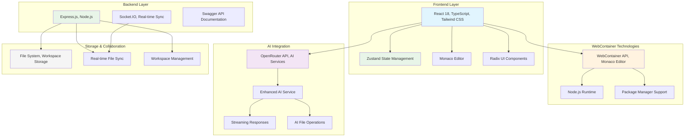

# Chapter 1: Introduction and Overview

## What is AutoCode?

AutoCode is a revolutionary web-based code editor that combines the power of modern development tools with artificial intelligence to create an intelligent coding environment. Built using cutting-edge web technologies, AutoCode provides developers with a VS Code-like experience directly in their browser, enhanced with AI-powered features that accelerate development.

### Core Vision

The primary vision behind AutoCode is to democratize development by:

- ✅ **Eliminating local development environment setup**
- ✅ **Providing instant access to development tools**
- ✅ **Integrating AI assistance throughout the coding process**
- ✅ **Enabling collaborative development in real-time**
- ✅ **Supporting multiple programming languages and frameworks**

## Key Features

### 🖥️ Web-Based IDE

- **Monaco Editor Integration**: Professional code editing experience with syntax highlighting, IntelliSense, and multi-cursor support
- **File System Management**: Complete file tree with drag-and-drop functionality
- **Multi-tab Support**: Work with multiple files simultaneously
- **Integrated Terminal**: Execute commands directly in the browser
- **Preview Panel**: Live preview of web applications

### 🤖 AI-Powered Development

- **Enhanced ChatBot**: Intelligent coding assistant powered by OpenRouter API
- **Context-Aware Suggestions**: AI understands your project structure and current file
- **Code Generation**: Generate code from natural language descriptions
- **Error Resolution**: Get AI help for debugging and fixing errors
- **Real-time Collaboration**: Sync changes across multiple users
- **File Operations**: AI can create, modify, and delete files automatically
- **Streaming Responses**: Real-time AI responses for better user experience

### 🔒 WebContainer Technology

- **Secure Sandboxing**: Code runs in isolated browser environments
- **Node.js Runtime**: Full Node.js environment in the browser
- **Package Management**: npm, yarn, and pnpm support
- **Dev Server Integration**: Automatic preview and hot reload
- **Singleton Pattern**: Ensures single WebContainer instance per browser tab

## Technology Stack Overview

### Frontend Technologies

| Technology | Description | Usage in AutoCode |
|-----------|-------------|-----------------|
| **React 18** | Modern component-based UI framework with concurrent features | Main UI framework, component architecture |
| **TypeScript** | Type-safe JavaScript for better code quality and developer experience | Type safety, interfaces, service definitions |
| **Vite** | Fast build tool and development server with hot module replacement | Development server, fast builds |
| **Tailwind CSS** | Utility-first CSS framework for rapid UI development | UI styling, VS Code theme implementation |
| **Monaco Editor** | VS Code's editor engine for professional code editing | Core code editing functionality |
| **Zustand** | Lightweight state management solution | Application state, chat state, project state |
| **@webcontainer/api** | Browser-based virtualization for running Node.js applications | Secure code execution environment |
| **@radix-ui** | Unstyled, accessible UI components | Modal, dropdown, select, tabs components |
| **Socket.IO Client** | Real-time communication for collaboration features | Real-time collaboration, file sync |
| **React Markdown** | Markdown rendering component | AI response formatting |
| **Lucide React** | Icon library | UI icons and visual elements |

### Backend Technologies

| Technology | Description | Usage in AutoCode |
|-----------|-------------|-----------------|
| **Express.js** | Fast, unopinionated web framework for Node.js | REST API server, file management |
| **Socket.IO** | Real-time bidirectional event-based communication | Real-time collaboration, file synchronization |
| **Multer** | Middleware for handling file uploads | File upload handling |
| **Swagger** | API documentation and testing interface | API documentation, interactive testing |
| **fs-extra** | Enhanced file system operations | File management, workspace operations |
| **dotenv** | Environment variable management | Configuration management |
| **CORS** | Cross-Origin Resource Sharing middleware | Frontend-backend communication |
| **UUID** | Unique identifier generation | Workspace and file ID generation |

### AI and Web Technologies

| Technology | Description | Usage in AutoCode |
|-----------|-------------|-----------------|
| **OpenRouter API** | Access to multiple AI models including GPT-4, Claude, and others | AI model access, chat functionality |
| **Enhanced AI Service** | Custom AI service with context management and file operations | Advanced AI features, file operations |
| **WebContainer API** | Browser-based virtualization for running Node.js applications | Secure code execution in browser |
| **Streaming API** | Real-time response streaming for AI interactions | Real-time AI chat experience |

## Project Structure

```mermaid
graph TD
    Root[autocode/] --> Client[client/]
    Root --> Server[server/]
    Root --> MarkdownDocs[markdown-docs/]
    Root --> PackageJson[package.json]
    Root --> README[README.md]

    Client --> Src[src/]
    Client --> Public[public/]
    Client --> PackageClient[package.json]
    Client --> ViteConfig[vite.config.ts]

    Server --> SrcServer[src/]
    Server --> Docs[docs/]
    Server --> PackageServer[package.json]
    Server --> IndexJS[index.js]

    Src --> Components[components/]
    Src --> Store[store/]
    Src --> Services[services/]
    Src --> Providers[providers/]
    Src --> Utils[utils/]

    Components --> ChatBot[ChatBot components]
    Components --> Editor[Editor components]
    Components --> UI[UI components]
    Components --> Modals[Modal components]

    Store --> EnhancedChat[enhancedChatStore.ts]
    Store --> Editor[editorStore.ts]
    Store --> Project[projectStore.ts]
    Store --> Sidebar[sidebarStore.ts]

    Services --> OpenRouter[openRouter.ts]
    Services --> EnhancedAI[enhancedAIService.ts]
    Services --> WebContainer[webcontainer services]
    Services --> FileOperations[aiFileOperations.ts]

    Providers --> WebContainer[WebContainerProvider.tsx]

    SrcServer --> Routes[routes/]
    SrcServer --> Config[config/]
    SrcServer --> Views[views/]

    Routes --> Files[files.js]
    Routes --> Projects[projects.js]
    Routes --> Templates[templates.js]

    style Root fill:#4CAF50,color:#fff
    style Client fill:#2196F3,color:#fff
    style Server fill:#FF9800,color:#fff
    style Src fill:#9C27B0,color:#fff
    style Components fill:#E91E63,color:#fff
    style Store fill:#4CAF50,color:#fff
    style Services fill:#2196F3,color:#fff
    style WebContainer fill:#FF9800,color:#fff
```

## Key Architectural Decisions

### Frontend Architecture

1. **Component-Based Design**: Modular React components with clear separation of concerns
2. **State Management**: Zustand for lightweight, efficient state management
3. **WebContainer Integration**: Singleton pattern for WebContainer instance management
4. **AI Integration**: OpenRouter API integration with enhanced context management
5. **Real-time Collaboration**: Socket.IO for real-time file synchronization

### Backend Architecture

1. **RESTful API**: Express.js-based REST API for file and project management
2. **Real-time Communication**: Socket.IO for real-time collaboration features
3. **File Management**: Server-side file storage and workspace management
4. **API Documentation**: Swagger/OpenAPI for comprehensive API documentation
5. **Security**: CORS, rate limiting, and input validation

### AI Integration Architecture

1. **Multi-Model Support**: OpenRouter API integration supporting multiple AI models
2. **Context Management**: Intelligent context building with file and project awareness
3. **Streaming Responses**: Real-time AI response streaming for better UX
4. **File Operations**: AI-powered file creation, modification, and deletion
5. **Error Handling**: Robust error handling and user feedback

## System Requirements

### Development Environment

- **Node.js**: Version 18.x or higher
- **npm**: Version 8.x or higher
- **Git**: For version control
- **Modern Browser**: Chrome 90+, Firefox 88+, Safari 14+, or Edge 90+
- **VS Code**: Recommended IDE (or any code editor with TypeScript support)

### Runtime Requirements

- **Browser Support**: Modern browsers with ES2020+ support
- **WebAssembly**: Must be enabled (default in modern browsers)
- **SharedArrayBuffer**: Required for WebContainer (may require specific headers)
- **HTTPS**: Required for WebContainer functionality in production
- **Memory**: Adequate browser memory for WebContainer operations

## Development Philosophy

### Core Principles

1. **Developer Experience First**: Every feature is designed to enhance the developer's workflow
2. **Security by Design**: All user code runs in isolated, sandboxed environments
3. **Performance Matters**: Optimized for speed and responsiveness
4. **Accessibility**: Ensure the platform is usable by developers of all abilities
5. **Extensibility**: Plugin-ready architecture for future enhancements

### Code Quality Standards

- ✅ TypeScript for type safety
- ✅ ESLint and Prettier for consistent code formatting
- ✅ Component-based architecture
- ✅ Comprehensive state management
- ✅ Error handling and user feedback
- ✅ API documentation with Swagger

## Target Audience

This application is designed for:

- **👨‍💻 Web Developers**: Building modern web applications
- **🎓 Students**: Learning programming in a structured environment
- **👥 Teams**: Collaborative development projects
- **👨‍🏫 Educators**: Teaching programming concepts
- **⚡ Rapid Prototypers**: Quick idea validation and MVP development

## Chapter Summary

In this chapter, we've introduced AutoCode as a comprehensive AI-powered code editor that combines modern web technologies with artificial intelligence. We've covered:

- The vision and core features of AutoCode
- Complete technology stack based on actual implementation
- System requirements for development and runtime
- Actual project structure and architecture
- Development philosophy and target audience

The following chapters will dive deep into each aspect of the system, starting with the development setup and progressing through architecture, implementation details, and deployment strategies.

> **🔑 Key Takeaway:** AutoCode represents the convergence of modern web development practices with AI assistance, creating a powerful, accessible, and intelligent coding environment that runs entirely in the browser with secure WebContainer technology.

---

**Next Chapter:** [Development Setup](./02-development-setup.md) → Learn how to set up your development environment and get started with AutoCode.