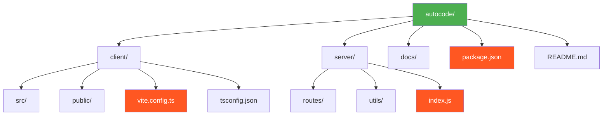

# Chapter 1: Introduction and Overview

## What is AutoCode?

AutoCode is a revolutionary web-based code editor that combines the power of modern development tools with artificial intelligence to create an intelligent coding environment. Built using cutting-edge web technologies, AutoCode provides developers with a VS Code-like experience directly in their browser, enhanced with AI-powered features that accelerate development.

### Core Vision

The primary vision behind AutoCode is to democratize development by:

- ✅ **Eliminating local development environment setup**
- ✅ **Providing instant access to development tools**
- ✅ **Integrating AI assistance throughout the coding process**
- ✅ **Enabling collaborative development in real-time**
- ✅ **Supporting multiple programming languages and frameworks**

## Key Features

### 🖥️ Web-Based IDE

- **Monaco Editor Integration**: Professional code editing experience with syntax highlighting, IntelliSense, and multi-cursor support
- **File System Management**: Complete file tree with drag-and-drop functionality
- **Multi-tab Support**: Work with multiple files simultaneously
- **Integrated Terminal**: Execute commands directly in the browser

### 🤖 AI-Powered Development

- **AutoChat**: Intelligent coding assistant powered by OpenRouter API
- **Context-Aware Suggestions**: AI understands your project structure
- **Code Generation**: Generate code from natural language descriptions
- **Error Resolution**: Get AI help for debugging and fixing errors
- **Real-time Collaboration**: Sync changes across multiple users

### 🔒 WebContainer Technology

- **Secure Sandboxing**: Code runs in isolated browser environments
- **Node.js Runtime**: Full Node.js environment in the browser
- **Package Management**: npm, yarn, and pnpm support
- **Dev Server Integration**: Automatic preview and hot reload

## Technology Stack Overview

```mermaid
graph TB
    subgraph "Frontend Layer"
        React[React 18, TypeScript, Tailwind CSS]
    end

    subgraph "Browser Technologies"
        WebContainer[WebContainer API, Monaco Editor]
        AI[OpenRouter API, AI Services]
        Socket[Socket.IO, Real-time Sync]
    end

    subgraph "Backend Layer"
        Express[Express.js, Node.js]
        API[REST API, File Management]
        WS[WebSocket, Collaboration]
    end

    subgraph "Storage"
        Storage[File System, Workspace Storage]
    end

    React --> WebContainer
    React --> AI
    React --> Socket
    WebContainer --> Express
    AI --> Express
    Socket --> WS
    Express --> API
    Express --> WS
    API --> Storage
    WS --> Storage

    style React fill:#e1f5fe
    style WebContainer fill:#fff3e0
    style AI fill:#f3e5f5
    style Socket fill:#e8f5e8
    style Express fill:#e8f5e8
    style API fill:#e8f5e8
    style WS fill:#e8f5e8
    style Storage fill:#f5f5f5
```

### Frontend Technologies

| Technology | Description |
|-----------|-------------|
| **React 18** | Modern component-based UI framework with concurrent features |
| **TypeScript** | Type-safe JavaScript for better code quality and developer experience |
| **Vite** | Fast build tool and development server with hot module replacement |
| **Tailwind CSS** | Utility-first CSS framework for rapid UI development |
| **Monaco Editor** | VS Code's editor engine for professional code editing |
| **Zustand** | Lightweight state management solution |
| **Socket.IO Client** | Real-time communication for collaboration features |

### Backend Technologies

| Technology | Description |
|-----------|-------------|
| **Express.js** | Fast, unopinionated web framework for Node.js |
| **Socket.IO** | Real-time bidirectional event-based communication |
| **Multer** | Middleware for handling file uploads |
| **Swagger** | API documentation and testing interface |
| **fs-extra** | Enhanced file system operations |
| **JWT** | Secure authentication and authorization |

### AI and Web Technologies

| Technology | Description |
|-----------|-------------|
| **OpenRouter API** | Access to multiple AI models including GPT-4, Claude, and others |
| **WebContainer API** | Browser-based virtualization for running Node.js applications |
| **WebAssembly** | High-performance code execution in the browser |
| **Service Workers** | Offline functionality and background operations |

## System Requirements

### Development Environment

- **Node.js**: Version 18.x or higher
- **npm**: Version 8.x or higher (or yarn 1.22+)
- **Git**: For version control
- **Modern Browser**: Chrome 90+, Firefox 88+, Safari 14+, or Edge 90+
- **IDE**: VS Code (recommended) or any code editor with TypeScript support

### Runtime Requirements

- **Browser Support**: Modern browsers with ES2020+ support
- **WebAssembly**: Must be enabled (default in modern browsers)
- **SharedArrayBuffer**: Required for WebContainer (may require specific headers)
- **HTTPS**: Required for WebContainer functionality in production

## Project Structure Overview



## Development Philosophy

### Core Principles

1. **Developer Experience First**: Every feature is designed to enhance the developer's workflow
2. **Security by Design**: All user code runs in isolated, sandboxed environments
3. **Performance Matters**: Optimized for speed and responsiveness
4. **Accessibility**: Ensure the platform is usable by developers of all abilities
5. **Extensibility**: Plugin-ready architecture for future enhancements

### Code Quality Standards

- ✅ TypeScript for type safety
- ✅ ESLint and Prettier for consistent code formatting
- ✅ Comprehensive testing with Jest and React Testing Library
- ✅ Code review processes for all changes
- ✅ Documentation-driven development

## Target Audience

This application is designed for:

- **👨‍💻 Web Developers**: Building modern web applications
- **🎓 Students**: Learning programming in a structured environment
- **👥 Teams**: Collaborative development projects
- **👨‍🏫 Educators**: Teaching programming concepts
- **⚡ Rapid Prototypers**: Quick idea validation and MVP development

## Chapter Summary

In this chapter, we've introduced AutoCode as a comprehensive AI-powered code editor that combines modern web technologies with artificial intelligence. We've covered:

- The vision and core features of AutoCode
- Complete technology stack overview
- System requirements for development and runtime
- High-level project structure
- Development philosophy and target audience

The following chapters will dive deep into each aspect of the system, starting with the development setup and progressing through architecture, implementation details, and deployment strategies.

> **🔑 Key Takeaway:** AutoCode represents the convergence of modern web development practices with AI assistance, creating a powerful, accessible, and intelligent coding environment that runs entirely in the browser.

---

**Next Chapter:** [Development Setup](./02-development-setup.md) → Learn how to set up your development environment and get started with AutoCode.