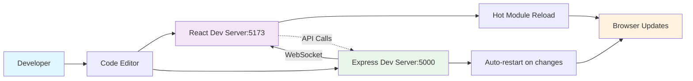

# Chapter 2: Development Setup

## Prerequisites and Environment Setup

This chapter will guide you through setting up a complete development environment for AutoCode, including all necessary tools, dependencies, and configurations based on the actual project implementation.

## System Requirements

### Operating System Support
- **Windows**: Windows 10 or later
- **macOS**: macOS 10.15 or later
- **Linux**: Any modern distribution (Ubuntu 18.04+, CentOS 7+, etc.)

### Required Software

| Tool | Minimum Version | Recommended Version | Purpose |
|------|----------------|-------------------|---------|
| **Node.js** | 18.x.x | 20.x.x LTS | JavaScript runtime |
| **npm** | 8.x.x | 10.x.x | Package manager |
| **Git** | 2.30.0 | 2.40.0+ | Version control |

## Project Setup

### Clone the Repository

```bash
# Clone the repository
git clone https://github.com/your-org/autocode.git
cd autocode

# Verify the structure
ls -la
```

### Install Dependencies

The project uses a monorepo structure with separate dependencies for client and server.

#### Root Dependencies

```bash
# Install root-level dependencies (includes concurrently for running both servers)
npm install
```

#### Client Dependencies

```bash
# Navigate to client directory
cd client

# Install frontend dependencies
npm install

# Return to root
cd ..
```

#### Server Dependencies

```bash
# Navigate to server directory
cd server

# Install backend dependencies
npm install

# Return to root
cd ..
```

### All-in-One Installation

You can install all dependencies at once using the root script:

```bash
# Install all dependencies for the entire project
npm run install:all
```

## Project Structure Overview

```
autocode/
├── client/                    # React frontend application
│   ├── src/
│   │   ├── components/         # Reusable React components
│   │   │   ├── ChatBot/        # ChatBot components
│   │   │   ├── modals/         # Modal components
│   │   │   ├── Editor.tsx      # Main editor component
│   │   │   ├── Sidebar.tsx     # File explorer sidebar
│   │   │   └── ...
│   │   ├── store/              # Zustand state management
│   │   │   ├── enhancedChatStore.ts  # Chat state management
│   │   │   ├── editorStore.ts      # Editor state
│   │   │   ├── projectStore.ts     # Project management state
│   │   │   └── sidebarStore.ts     # Sidebar state
│   │   ├── services/           # API and external services
│   │   │   ├── openRouter.ts    # OpenRouter AI service
│   │   │   ├── enhancedAIService.ts  # Enhanced AI features
│   │   │   ├── aiFileOperations.ts   # AI file operations
│   │   │   └── ...
│   │   ├── providers/          # React context providers
│   │   │   └── WebContainerProvider.tsx
│   │   ├── utils/              # Utility functions
│   │   └── App.tsx             # Main application component
│   ├── public/                 # Static assets
│   ├── package.json           # Frontend dependencies
│   ├── vite.config.ts         # Vite configuration
│   └── tailwind.config.js     # Tailwind CSS configuration
├── server/                   # Node.js backend application
│   ├── src/
│   │   ├── routes/            # Express route handlers
│   │   │   ├── files.js       # File management routes
│   │   │   ├── projects.js    # Project management routes
│   │   │   └── templates.js   # Template routes
│   │   ├── config/            # Server configuration
│   │   │   └── swagger.js     # API documentation
│   │   ├── views/              # Server views
│   │   │   └── api-docs.html  # API documentation page
│   │   └── workspaces/         # User workspaces storage
│   ├── package.json           # Backend dependencies
│   └── index.js               # Server entry point
├── markdown-docs/            # This documentation
├── package.json              # Root package.json with scripts
└── README.md                 # Project README
```

## Development Workflow

### Running the Development Servers

The project uses a concurrent development setup to run both frontend and backend simultaneously.

#### Option 1: Using Root Package Scripts (Recommended)

```bash
# Start both client and server simultaneously
npm run dev

# This runs:
# - npm run client:dev  (Frontend on http://localhost:5173)
# - npm run server:dev  (Backend on http://localhost:5000)
```

#### Option 2: Separate Terminals

**Terminal 1 - Backend:**
```bash
cd server
npm run dev
# Server runs on http://localhost:5000
```

**Terminal 2 - Frontend:**
```bash
cd client
npm run dev
# Client runs on http://localhost:5173
```

### Development Workflow Diagram



## Configuration

### Environment Variables

No explicit environment variables are required for basic development. The application is configured to work out of the box with default settings.

#### Optional Environment Variables

You can create a `.env` file in the server directory for additional configuration:

```env
# Server Configuration
PORT=5000
NODE_ENV=development
```

### Frontend Configuration

The frontend uses Vite for development and building. Key configuration files:

**`client/vite.config.ts`**:
- Vite configuration with React plugin
- Development server settings
- Build optimization

**`client/tailwind.config.js`**:
- Tailwind CSS configuration
- VS Code theme colors
- Custom design system

### Backend Configuration

**`server/index.js`**: Main server configuration
- Express server setup
- Socket.IO for real-time features
- CORS configuration for frontend communication
- Swagger API documentation
- File system management

## Key Development Features

### Frontend Features

1. **Hot Module Replacement (HMR)**: Instant UI updates during development
2. **TypeScript Support**: Full type safety with TypeScript
3. **ESLint Integration**: Code quality and consistency checks
4. **Tailwind CSS**: Utility-first CSS with VS Code theme
5. **Monaco Editor**: Professional code editing experience

### Backend Features

1. **Auto-restart**: Server automatically restarts on file changes
2. **API Documentation**: Interactive Swagger documentation at `/api-docs`
3. **Real-time Communication**: Socket.IO for live collaboration
4. **File Management**: Secure file storage and workspace management
5. **CORS Configuration**: Proper cross-origin setup for development

### AI Integration

1. **OpenRouter API**: AI model integration with multiple model support
2. **Streaming Responses**: Real-time AI chat responses
3. **Context Management**: AI understands project structure and current files
4. **File Operations**: AI can create, modify, and delete files
5. **Enhanced Chat Interface**: Advanced chat with settings and model selection

## Browser Support

### Required Browser Features

For WebContainer functionality to work properly, ensure your browser supports:

- **WebAssembly**: Enabled by default in modern browsers
- **SharedArrayBuffer**: Required for WebContainer
- **Cross-Origin Isolation**: May need specific headers in production
- **CORS Policies**: Properly configured for development

### Recommended Browsers

- **Chrome 90+** (Recommended for development)
- **Firefox 88+**
- **Safari 14+**
- **Edge 90+**

## Development Tools

### IDE Configuration

#### VS Code Extensions (Recommended)

```json
{
  "recommendations": [
    "ms-vscode.vscode-typescript-next",
    "bradlc.vscode-tailwindcss",
    "esbenp.prettier-vscode",
    "dbaeumer.vscode-eslint",
    "ms-vscode.vscode-json",
    "formulahendry.auto-rename-tag",
    "christian-kohler.path-intellisense",
    "ms-vscode.vscode-markdown",
    "bierner.markdown-mermaid",
    "yzhang.markdown-all-in-one"
  ]
}
```

### Code Quality Tools

#### Frontend (.eslintrc.cjs)
- React hooks rules
- TypeScript checking
- Prettier integration
- Import organization

#### Linting Commands

```bash
# Lint frontend code
cd client
npm run lint
```

## API Documentation

### Interactive API Documentation

Once the server is running, you can access interactive API documentation:

- **Swagger UI**: http://localhost:5000/api-docs
- **API JSON**: http://localhost:5000/api-docs.json
- **API Root**: http://localhost:5000/api (redirects to docs)

### Available Endpoints

- **File Management**: `/api/files/*`
- **Project Management**: `/api/projects/*`
- **Templates**: `/api/templates/*`
- **Health Check**: `/api/health`

## Troubleshooting

### Common Issues

#### Port Already in Use
```bash
# Find process using port
netstat -ano | findstr :5000  # Windows
lsof -i :5000               # macOS/Linux

# Kill process
taskkill /PID <PID> /F     # Windows
kill -9 <PID>               # macOS/Linux
```

#### WebContainer Issues

1. **Browser Compatibility**: Ensure you're using a supported browser
2. **HTTPS in Production**: WebContainer requires HTTPS in production environments
3. **Memory Issues**: Close other tabs to free up browser memory
4. **CORS Headers**: Check browser console for CORS errors

#### Dependency Issues

```bash
# Clear npm cache
npm cache clean --force

# Delete node_modules and reinstall
rm -rf node_modules package-lock.json
npm install

# For client
cd client && rm -rf node_modules package-lock.json && npm install

# For server
cd server && rm -rf node_modules package-lock.json && npm install
```

#### Development Server Issues

```bash
# Check if ports are available
netstat -an | grep :5173  # Client port
netstat -an | grep :5000  # Server port

# Restart services
npm run dev

# Check logs for errors
```

### Performance Issues

#### Slow Development Server
```bash
# Increase Node.js memory limit
export NODE_OPTIONS="--max-old-space-size=4096"

# Use Vite's experimental features
# Add to vite.config.ts if needed
```

#### Build Issues

```bash
# Build frontend
cd client
npm run build

# Check for TypeScript errors
npx tsc --noEmit
```

## Chapter Summary

In this chapter, we've covered the complete development setup for AutoCode based on the actual implementation:

- ✅ System requirements and prerequisites
- ✅ Installation of development tools and dependencies
- ✅ Project structure and organization
- ✅ Development workflow with concurrent servers
- ✅ Configuration details for frontend and backend
- ✅ API documentation access
- ✅ Troubleshooting common issues

### Next Steps

With your development environment properly set up, you're now ready to:

1. **Start Development**: Run `npm run dev` to start both servers
2. **Explore the Application**: Open http://localhost:5173 in your browser
3. **Check API Documentation**: Visit http://localhost:5000/api-docs
4. **Experiment with Features**: Try the AI chat, file operations, and WebContainer
5. **Review the Code**: Examine the actual implementation in `client/src` and `server/src`

> **🔑 Key Takeaway**: AutoCode's development environment is designed for productivity with hot reloading, comprehensive tooling, and seamless integration between frontend and backend services.

---

**Next Chapter:** [System Architecture and Design](./03-system-architecture.md) → Dive deep into the architectural patterns and design principles that power AutoCode.