# Chapter 3: System Architecture and Design

## Overview

AutoCode follows a modern, scalable architecture that separates concerns while maintaining high performance and security. This chapter explores the architectural decisions, design patterns, and system components that make AutoCode a robust AI-powered code editor.

## High-Level Architecture

### System Architecture Diagram

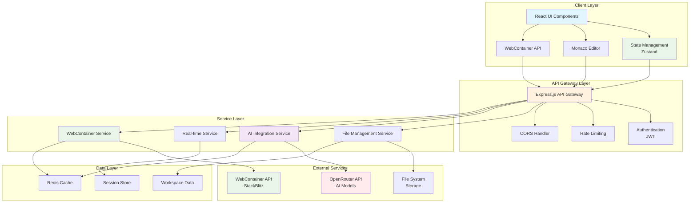

### Architectural Principles

1. **Separation of Concerns**: Each layer has distinct responsibilities
2. **Scalability**: Horizontal scaling with microservices architecture
3. **Security**: Sandboxed execution and secure API communication
4. **Performance**: Optimized for real-time collaboration and AI interactions
5. **Maintainability**: Clean code architecture with comprehensive testing

## Frontend Architecture

### Component Architecture

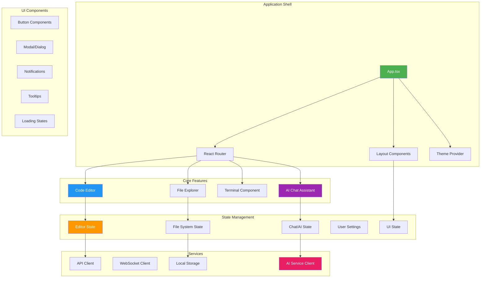

### State Management Pattern

AutoCode uses Zustand for state management with a store-based architecture:

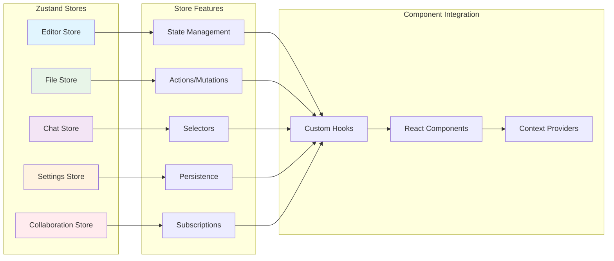

### Component Design Patterns

#### 1. Compound Components Pattern

```typescript
// Example: Code Editor Compound Component
const CodeEditor = ({ children, ...props }) => {
  const [state, setState] = useState(initialState);

  return (
    <EditorContext.Provider value={{ state, setState }}>
      <div className="code-editor">
        {children}
      </div>
    </EditorContext.Provider>
  );
};

CodeEditor.Toolbar = EditorToolbar;
CodeEditor.Content = EditorContent;
CodeEditor.StatusBar = EditorStatusBar;
CodeEditor.Sidebar = EditorSidebar;

// Usage:
<CodeEditor>
  <CodeEditor.Toolbar />
  <CodeEditor.Content />
  <CodeEditor.StatusBar />
</CodeEditor>
```

#### 2. Render Props Pattern

```typescript
// Example: File Explorer with Render Props
const FileExplorer = ({ children }) => {
  const [files, setFiles] = useState([]);
  const [selectedFile, setSelectedFile] = useState(null);

  return children({
    files,
    selectedFile,
    onSelectFile: setSelectedFile,
    onCreateFile: createFile,
    onDeleteFile: deleteFile,
    onRenameFile: renameFile
  });
};

// Usage:
<FileExplorer>
  {({ files, selectedFile, onSelectFile }) => (
    <div>
      {files.map(file => (
        <FileItem
          key={file.id}
          file={file}
          selected={selectedFile?.id === file.id}
          onClick={() => onSelectFile(file)}
        />
      ))}
    </div>
  )}
</FileExplorer>
```

#### 3. Custom Hooks Pattern

```typescript
// Example: Use AI Chat Hook
const useAIChat = (apiKey, model) => {
  const [messages, setMessages] = useState([]);
  const [isLoading, setIsLoading] = useState(false);
  const [error, setError] = useState(null);

  const sendMessage = useCallback(async (content) => {
    setIsLoading(true);
    setError(null);

    try {
      const response = await fetch('/api/ai/chat', {
        method: 'POST',
        headers: { 'Content-Type': 'application/json' },
        body: JSON.stringify({ content, model })
      });

      const data = await response.json();
      setMessages(prev => [...prev, data]);
    } catch (err) {
      setError(err.message);
    } finally {
      setIsLoading(false);
    }
  }, [apiKey, model]);

  return { messages, sendMessage, isLoading, error };
};
```

## Backend Architecture

### Microservices Design

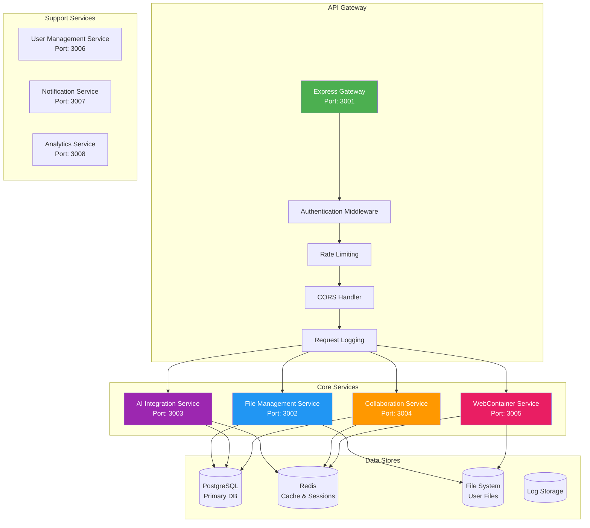

### Service Communication Patterns

#### 1. REST API Communication

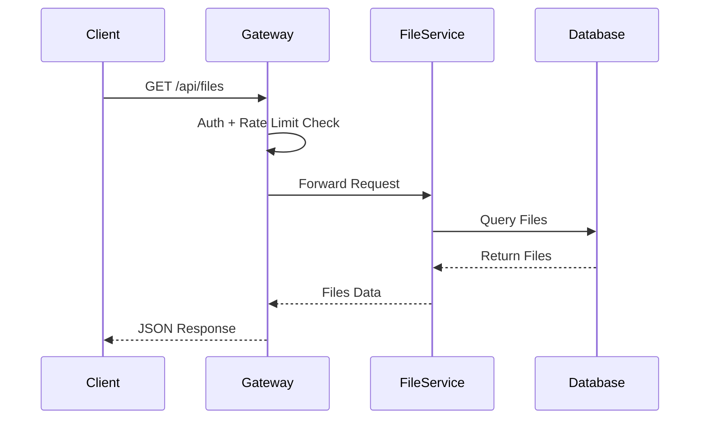

#### 2. WebSocket Communication

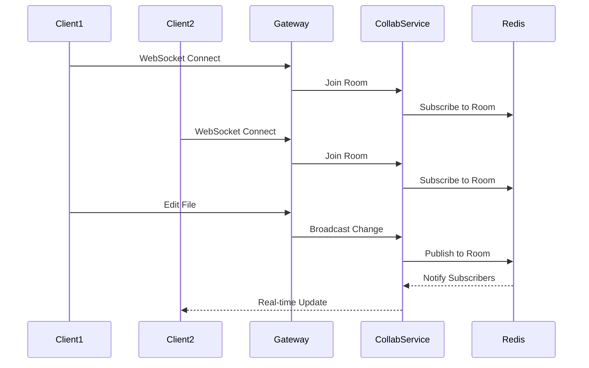

#### 3. Service-to-Service Communication

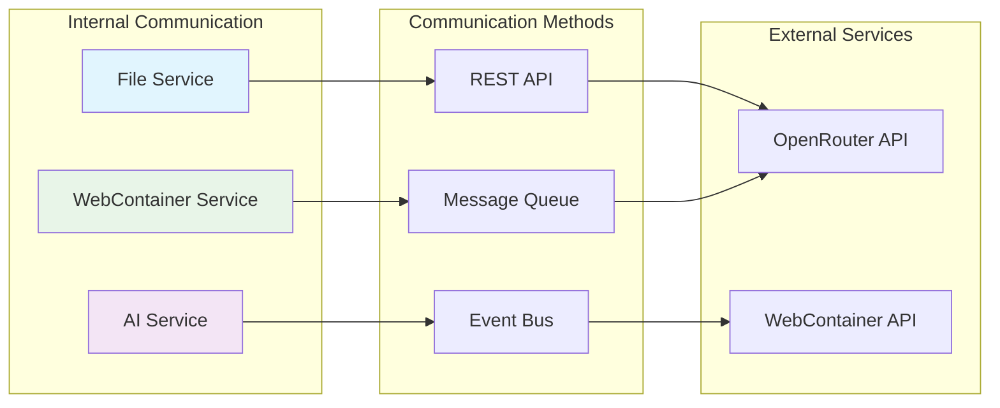

## Data Architecture

### Database Schema Design

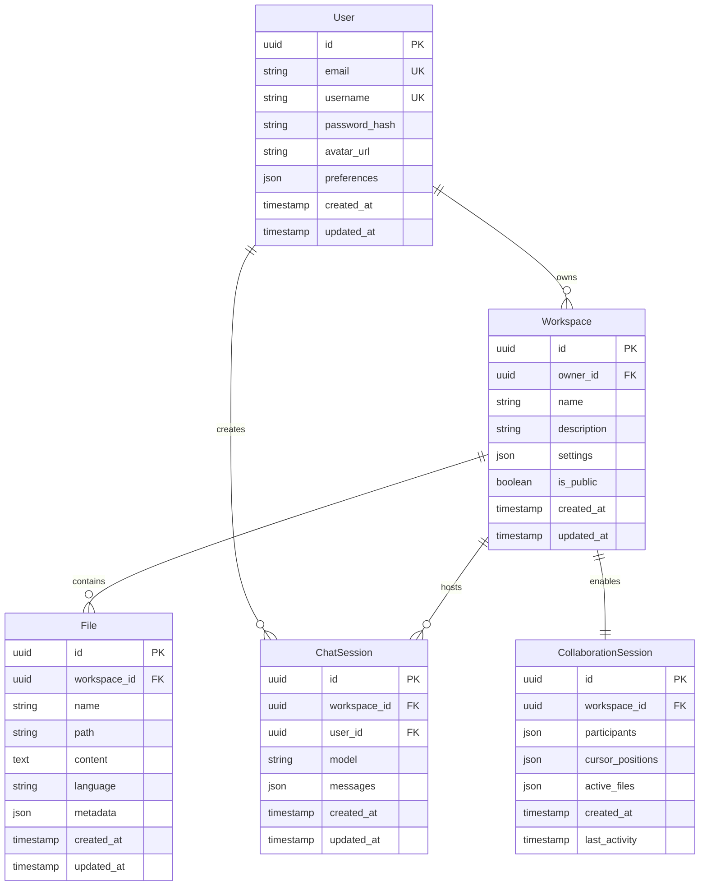

### Caching Strategy

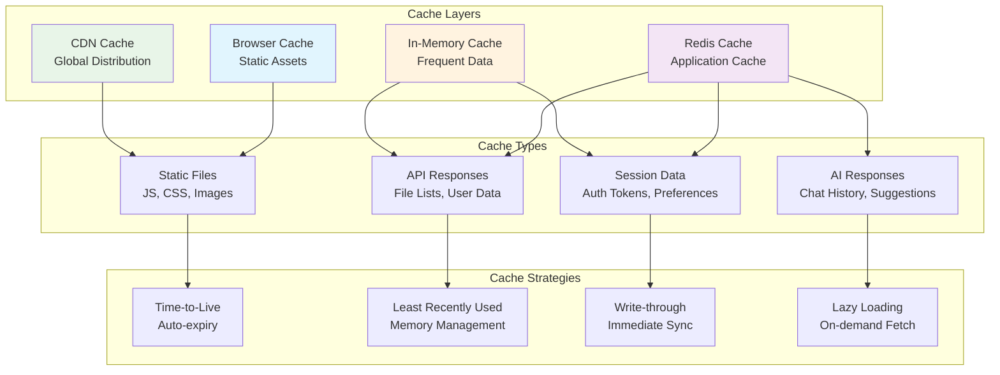

## Security Architecture

### Security Layers

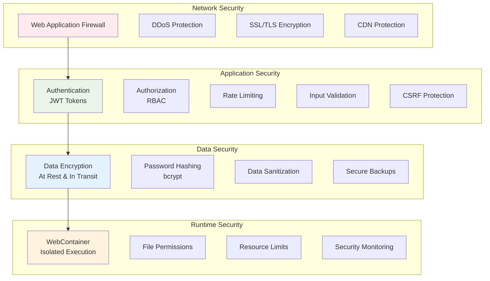

### Authentication & Authorization Flow

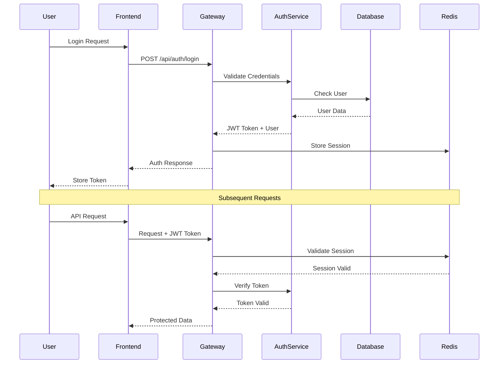

## Performance Architecture

### Performance Optimization Layers

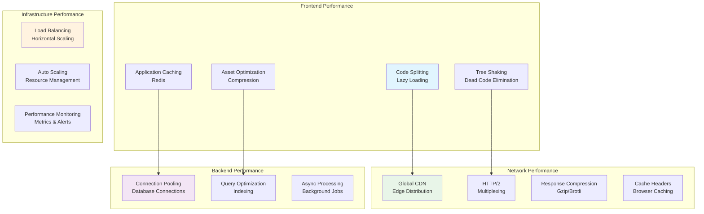

### Monitoring and Observability

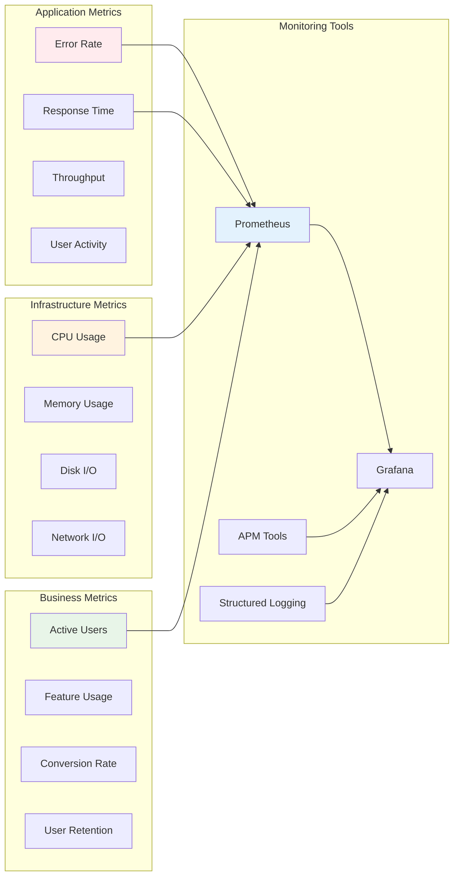

## Scalability Architecture

### Horizontal Scaling Strategy

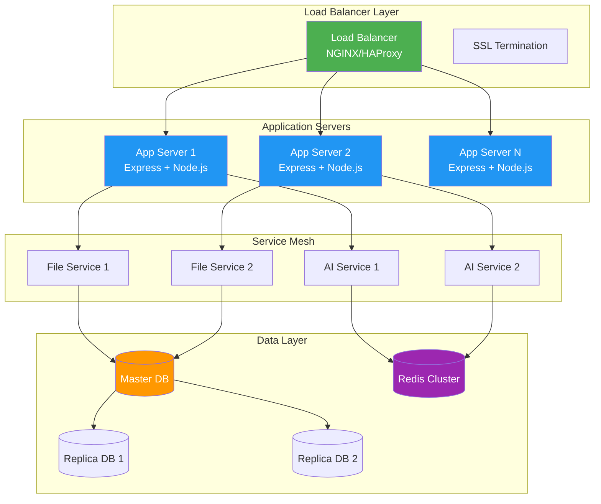

### Auto-scaling Configuration

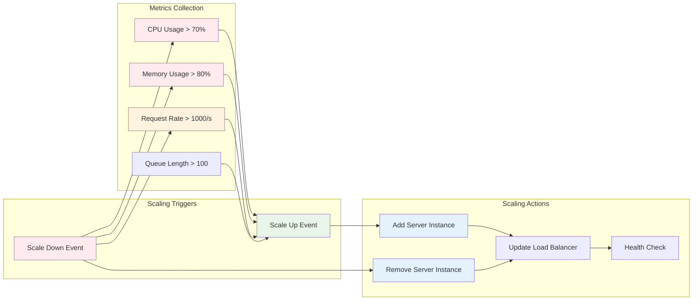

## Disaster Recovery and High Availability

### High Availability Architecture

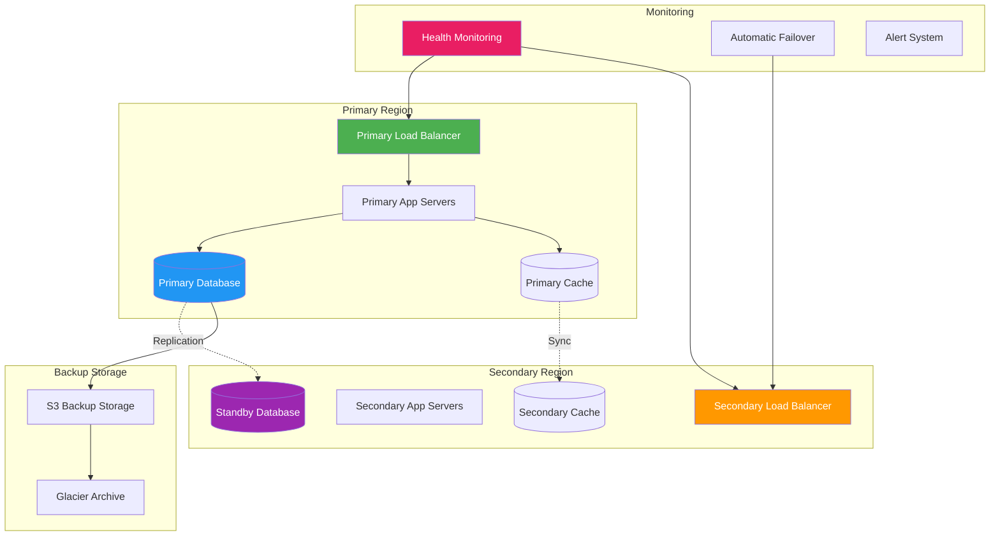

### Backup and Recovery Strategy

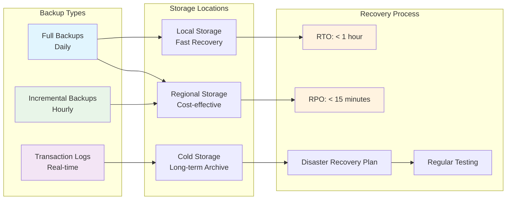

## Chapter Summary

In this comprehensive chapter, we've explored the intricate architecture of AutoCode:

- ✅ **High-level system architecture** with clear separation of concerns
- ✅ **Frontend architecture** using React, Zustand, and modern patterns
- ✅ **Backend microservices architecture** with scalable design
- ✅ **Data architecture** with optimized database and caching strategies
- ✅ **Security architecture** with multiple layers of protection
- ✅ **Performance optimization** across all system layers
- ✅ **Scalability architecture** supporting horizontal scaling
- ✅ **Disaster recovery** ensuring high availability

### Key Architectural Decisions

1. **Microservices Pattern**: Enables independent scaling and development
2. **Event-Driven Architecture**: Supports real-time collaboration
3. **WebContainer Integration**: Provides secure code execution
4. **AI-First Design**: Integrates AI throughout the application
5. **Progressive Enhancement**: Graceful degradation for compatibility

### Design Benefits

- **🚀 Performance**: Optimized for real-time collaboration and AI interactions
- **🔒 Security**: Multi-layered security with sandboxed execution
- **📈 Scalability**: Horizontal scaling support for growing user base
- **🛡️ Reliability**: High availability with disaster recovery
- **🔧 Maintainability**: Clean architecture with comprehensive testing

> **🔑 Key Takeaway:** AutoCode's architecture is designed to handle the complex requirements of an AI-powered code editor while maintaining performance, security, and scalability at every layer.

---

**Next Chapter:** [WebContainer Implementation](./04-webcontainer-implementation.md) → Dive deep into the WebContainer technology that powers secure code execution in AutoCode.