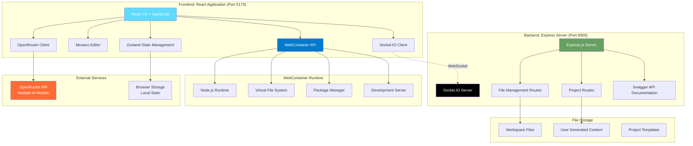
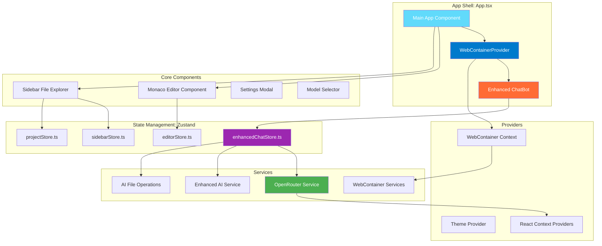
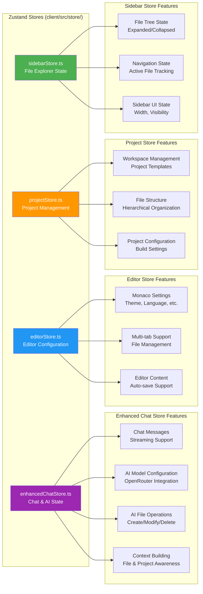
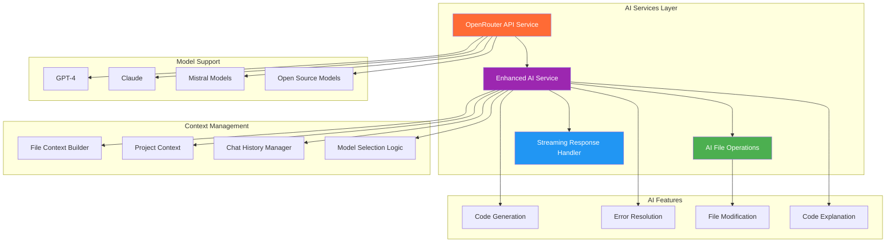
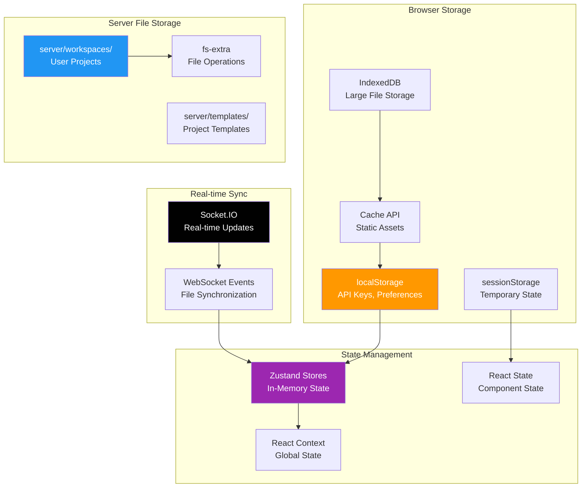
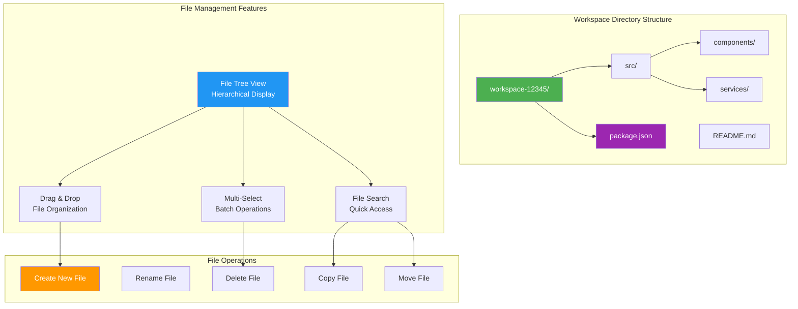
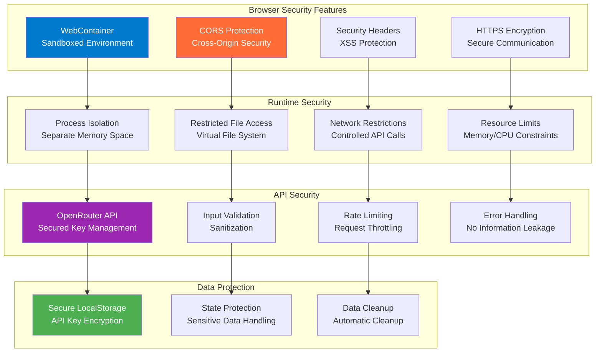
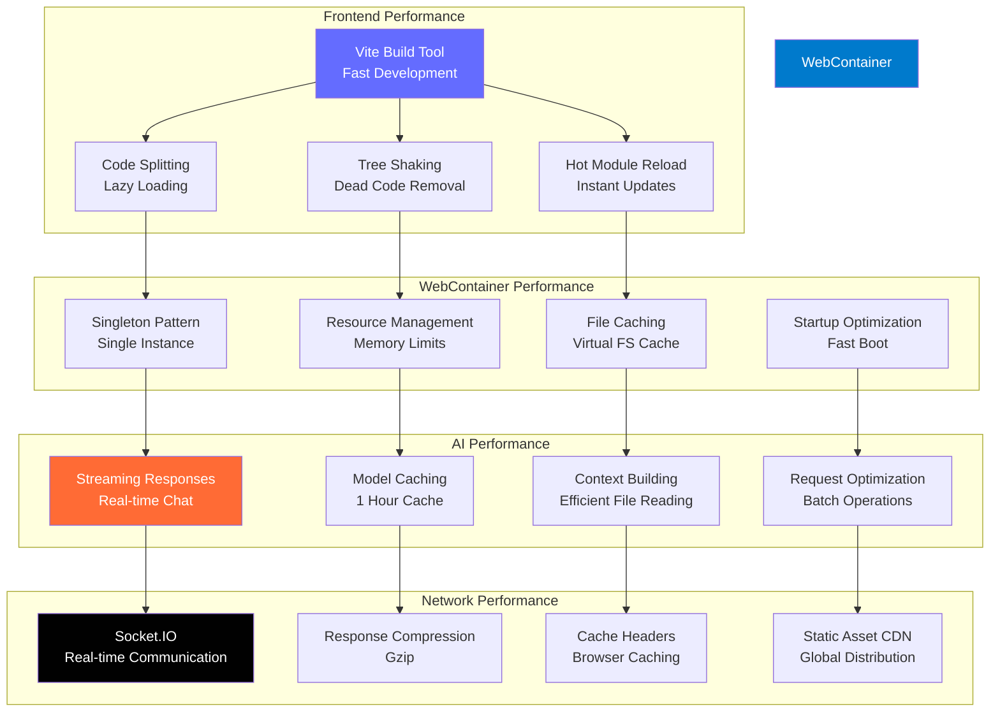
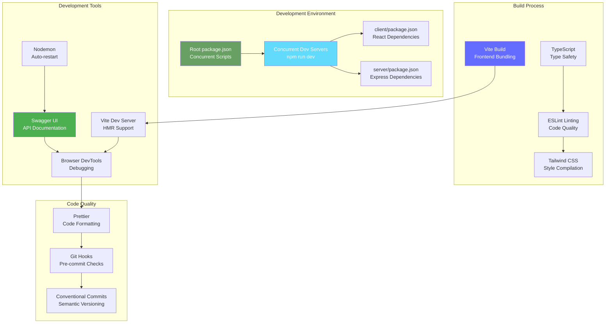

# Chapter 3: System Architecture and Design

## Overview

AutoCode implements a modern, full-stack architecture that combines web-based development tools with AI assistance. The system is built as a monorepo with a React frontend and Express.js backend, leveraging WebContainer technology for secure code execution directly in the browser. This chapter explores the actual architectural decisions and implementation details based on the real AutoCode codebase.

## High-Level Architecture

### Actual System Architecture



### Core Architectural Principles

1. **Browser-First Development**: Code execution and development happen entirely in the browser using WebContainer
2. **Real-Time Collaboration**: Socket.IO enables live file synchronization and multi-user editing
3. **AI-Powered Development**: OpenRouter integration provides context-aware AI assistance throughout the coding process
4. **Monorepo Structure**: Unified codebase with shared tooling and concurrent development servers
5. **Component-Based Architecture**: Modular React components with clear separation of concerns
6. **Singleton WebContainer Pattern**: Ensures exactly one WebContainer instance per browser tab

## Frontend Architecture

### React Application Structure

The frontend is built with React 18, TypeScript, and Vite, following a component-based architecture:



### Actual Zustand State Management Architecture

AutoCode uses Zustand with four specialized stores based on the actual implementation:



### AI Integration Architecture



### Actual Component Implementation Patterns

#### 1. WebContainer Singleton Pattern (WebContainerProvider.tsx)

```typescript
// Actual WebContainer singleton implementation
class WebContainerSingleton {
  static async getInstance(): Promise<WebContainer> {
    // If already booted globally, return existing instance
    if (window.__WEBCONTAINER_INSTANCE__) {
      return window.__WEBCONTAINER_INSTANCE__;
    }

    // If boot in progress globally, wait for it
    if (window.__WEBCONTAINER_BOOT_PROMISE__) {
      return window.__WEBCONTAINER_BOOT_PROMISE__;
    }

    // Start boot process with global state management
    window.__WEBCONTAINER_BOOTING__ = true;
    window.__WEBCONTAINER_BOOT_PROMISE__ = (async () => {
      const instance = await WebContainer.boot();
      window.__WEBCONTAINER_INSTANCE__ = instance;
      window.__WEBCONTAINER_BOOTING__ = false;
      return instance;
    })();

    return window.__WEBCONTAINER_BOOT_PROMISE__;
  }
}
```

#### 2. OpenRouter Service Pattern (openRouter.ts)

```typescript
// Actual OpenRouter service with caching and streaming
export class OpenRouterService {
  static async sendMessage(
    model: string,
    messages: ChatMessage[],
    options: {
      maxTokens?: number;
      temperature?: number;
      stream?: boolean;
      onChunk?: (chunk: string) => void;
    } = {}
  ): Promise<string> {
    // Handle streaming responses
    if (options.stream && response.body) {
      return this.handleStreamingResponse(response, options.onChunk);
    }

    // Regular response handling
    const data = await response.json();
    return data.choices[0].message.content;
  }
}
```

#### 3. Zustand Store Pattern (enhancedChatStore.ts)

```typescript
// Actual Zustand store implementation
interface ChatState {
  // State
  messages: ChatMessage[];
  isLoading: boolean;
  model: string;
  apiKey: string | null;

  // Actions
  sendMessage: (content: string) => Promise<void>;
  setModel: (model: string) => void;
  setApiKey: (apiKey: string) => void;
  clearMessages: () => void;
}

export const useChatStore = create<ChatState>((set, get) => ({
  messages: [],
  isLoading: false,
  model: 'gpt-3.5-turbo',
  apiKey: OpenRouterService.getApiKey(),

  sendMessage: async (content: string) => {
    // Implementation with streaming support
  }
}));
```

## Backend Architecture

### Express.js Server Implementation

The backend is a single Express.js server (not microservices) with a modular structure:

```mermaid
graph TB
    subgraph "Express Server (Port 5000)"
        MainServer[index.js<br/>Main Server File]
        Security[Security Middleware<br/>CORS, Headers]
        FileRoutes[/api/files<br/>File Management]
        ProjectRoutes[/api/projects<br/>Project Management]
        TemplateRoutes[/api/templates<br/>Project Templates]
        Swagger[Swagger Documentation<br/>API Docs]
    end

    subgraph "Real-time Features"
        SocketIOServer[Socket.IO Server<br/>Real-time Collaboration]
        WebSocketEvents[WebSocket Events<br/>File Sync, Join Workspace]
    end

    subgraph "File Storage"
        WorkspacesDir[workspaces/<br/>User Workspaces]
        FileSystem[fs-extra<br/>File Operations]
        FileUpload[Multer<br/>File Upload Handler]
    end

    subgraph "API Documentation"
        SwaggerUI[Swagger UI<br/>/api-docs]
        APIDocs[Interactive API<br/>Documentation]
        HealthCheck[Health Endpoint<br/>/api/health]
    end

    MainServer --> Security
    MainServer --> FileRoutes
    MainServer --> ProjectRoutes
    MainServer --> TemplateRoutes
    MainServer --> Swagger

    MainServer --> SocketIOServer
    SocketIOServer --> WebSocketEvents

    FileRoutes --> WorkspacesDir
    ProjectRoutes --> WorkspacesDir
    WorkspacesDir --> FileSystem
    FileRoutes --> FileUpload

    Swagger --> SwaggerUI
    Swagger --> APIDocs
    MainServer --> HealthCheck

    style MainServer fill:#68A063,color:#fff
    style FileRoutes fill:#2196F3,color:#fff
    style SocketIOServer fill:#010101,color:#fff
    style WorkspacesDir fill:#FF9800,color:#fff
    style SwaggerUI fill:#4CAF50,color:#fff
```

### Actual API Structure and Communication

#### 1. REST API Implementation (server/index.js)

```typescript
// Actual Express server setup
const app = express();
const server = createServer(app);
const io = new Server(server, {
  cors: {
    origin: ["http://localhost:3000", "http://localhost:5173"],
    methods: ["GET", "POST", "PUT", "DELETE"]
  }
});

// Security middleware
app.use((req, res, next) => {
  res.setHeader('X-Content-Type-Options', 'nosniff');
  res.setHeader('X-Frame-Options', 'DENY');
  res.setHeader('X-XSS-Protection', '1; mode=block');
  next();
});

// CORS configuration
app.use(cors({
  origin: ["http://localhost:3000", "http://localhost:5173"],
  credentials: true
}));
```

#### 2. Socket.IO Real-time Communication

```typescript
// Actual Socket.IO implementation
io.on('connection', (socket) => {
  console.log('Client connected:', socket.id);

  socket.on('join-workspace', (workspaceId) => {
    socket.join(`workspace-${workspaceId}`);
    console.log(`Client ${socket.id} joined workspace ${workspaceId}`);
  });

  socket.on('file-change', (data) => {
    socket.to(`workspace-${data.workspaceId}`).emit('file-changed', data);
  });

  socket.on('disconnect', () => {
    console.log('Client disconnected:', socket.id);
  });
});
```

#### 3. File Storage Architecture

```mermaid
graph TB
    subgraph "File System Structure"
        ServerRoot[server/]
        Workspaces[workspaces/<br/>User Workspaces]
        Templates[templates/<br/>Project Templates]
        Routes[src/routes/<br/>API Routes]
        Views[src/views/<br/>HTML Views]
    end

    subgraph "File Management Routes"
        FilesRoute[/api/files<br/>CRUD Operations]
        ProjectsRoute[/api/projects<br/>Project Management]
        TemplatesRoute[/api/templates<br/>Template Access]
    end

    subgraph "File Operations"
        Create[Create Files/Directories]
        Read[Read File Content]
        Update[Update File Content]
        Delete[Delete Files/Directories]
        Upload[File Upload<br/>Multer Handler]
    end

    Workspaces --> FilesRoute
    Templates --> TemplatesRoute
    Workspaces --> Create
    Workspaces --> Read
    Workspaces --> Update
    Workspaces --> Delete

    FilesRoute --> Upload
    ProjectsRoute --> Workspaces

    style ServerRoot fill:#68A063,color:#fff
    style Workspaces fill:#FF9800,color:#fff
    style FilesRoute fill:#2196F3,color:#fff
    style Upload fill:#4CAF50,color:#fff
```

## Data and Storage Architecture

### Browser-Based Storage Strategy

AutoCode uses browser storage rather than traditional databases:



### Workspace File Structure



## Security Architecture

### Browser Security and Sandboxing

AutoCode leverages browser security features and WebContainer isolation:



### API Key Management

```typescript
// Actual API key security implementation
export class OpenRouterService {
  private static readonly STORAGE_KEY = 'openrouter_api_key';

  static setApiKey(apiKey: string): void {
    localStorage.setItem(this.STORAGE_KEY, apiKey.trim());
  }

  static getApiKey(): string | null {
    return localStorage.getItem(this.STORAGE_KEY);
  }

  static isValidApiKey(apiKey: string): boolean {
    return apiKey.trim().length > 0 && apiKey.startsWith('sk-');
  }
}
```

## Performance Architecture

### WebContainer Performance Optimization



### Memory and Resource Management

```typescript
// Actual WebContainer singleton resource management
class WebContainerSingleton {
  static async getInstance(): Promise<WebContainer> {
    // Global instance prevents memory leaks
    if (window.__WEBCONTAINER_INSTANCE__) {
      return window.__WEBCONTAINER_INSTANCE__;
    }

    // Boot process with resource optimization
    window.__WEBCONTAINER_BOOT_PROMISE__ = (async () => {
      const instance = await WebContainer.boot();
      // Global reference for garbage collection management
      window.__WEBCONTAINER_INSTANCE__ = instance;
      return instance;
    })();

    return window.__WEBCONTAINER_BOOT_PROMISE__;
  }
}
```

## Development and Deployment Architecture

### Monorepo Development Workflow



### API Documentation Architecture

```mermaid
graph TB
    subgraph "Swagger Documentation"
        SwaggerSpec[Swagger Spec<br/>API Definition]
        SwaggerUI[Swagger UI<br/>Interactive Docs]
        APIDocs[/api-docs<br/>Documentation Page]
        HealthCheck[/api/health<br/>Service Status]
    end

    subgraph "API Routes Structure"
        FilesAPI[/api/files<br/>File Operations]
        ProjectsAPI[/api/projects<br/>Project Management]
        TemplatesAPI[/api/templates<br/>Template Access]
        APIRoot[/api<br/>Root Redirect]
    end

    subgraph "Documentation Features"
        Interactive[Interactive Testing<br/>Try API Endpoints]
        SchemaDisplay[Schema Display<br/>Request/Response Models]
        ErrorCodes[Error Documentation<br/>HTTP Status Codes]
        Examples[Code Examples<br/>Usage Samples]
    end

    SwaggerSpec --> SwaggerUI
    SwaggerUI --> APIDocs
    APIDocs --> HealthCheck

    FilesAPI --> SwaggerSpec
    ProjectsAPI --> SwaggerSpec
    TemplatesAPI --> SwaggerSpec
    APIRoot --> APIDocs

    SwaggerUI --> Interactive
    Interactive --> SchemaDisplay
    SchemaDisplay --> ErrorCodes
    ErrorCodes --> Examples

    style SwaggerSpec fill:#4CAF50,color:#fff
    style FilesAPI fill:#2196F3,color:#fff
    style Interactive fill:#FF9800,color:#fff
    style Examples fill:#9C27B0,color:#fff
```

## Chapter Summary

In this chapter, we've explored the actual architecture of AutoCode based on the real implementation:

- ✅ **React 18 + TypeScript Frontend** with Vite build system and hot reloading
- ✅ **Express.js Backend** with Socket.IO for real-time collaboration
- ✅ **Zustand State Management** with four specialized stores
- ✅ **WebContainer Singleton Pattern** for secure browser-based code execution
- ✅ **OpenRouter AI Integration** with streaming responses and multiple model support
- ✅ **Browser-Based Storage** using localStorage and server-side file system
- ✅ **Real-Time Collaboration** via Socket.IO with workspace management
- ✅ **Comprehensive API Documentation** with Swagger interactive interface

### Key Architectural Decisions

1. **Monorepo Structure**: Unified codebase with concurrent development servers
2. **WebContainer Integration**: Secure, sandboxed code execution in the browser
3. **Singleton Pattern**: Ensures exactly one WebContainer instance per browser tab
4. **State Management**: Zustand stores with clear separation of concerns
5. **Real-Time Features**: Socket.IO enables live collaboration and file synchronization
6. **API-First Design**: Comprehensive REST API with interactive documentation

### Technical Benefits

- **🚀 Performance**: Vite's fast build system and WebContainer optimization
- **🔒 Security**: Sandboxed execution environment and secure API key management
- **⚡ Real-Time**: Socket.IO enables instant collaboration features
- **🧠 AI-Powered**: Context-aware AI assistance with streaming responses
- **📚 Self-Documented**: Interactive API documentation with Swagger
- **🔧 Developer Experience**: Hot reloading, TypeScript, and modern tooling

> **🔑 Key Takeaway:** AutoCode's architecture successfully combines modern web technologies with AI capabilities, creating a powerful development environment that runs entirely in the browser while maintaining security, performance, and real-time collaboration features.

---

**Next Chapter:** [WebContainer Implementation](./04-webcontainer-implementation.md) → Dive deep into the WebContainer technology that powers secure code execution in AutoCode.