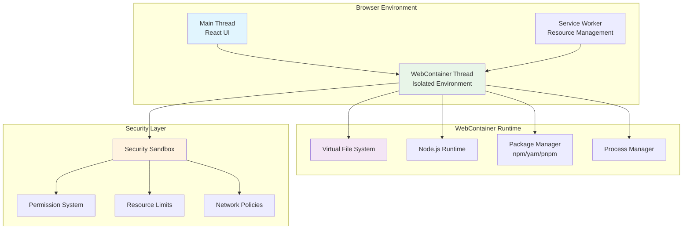
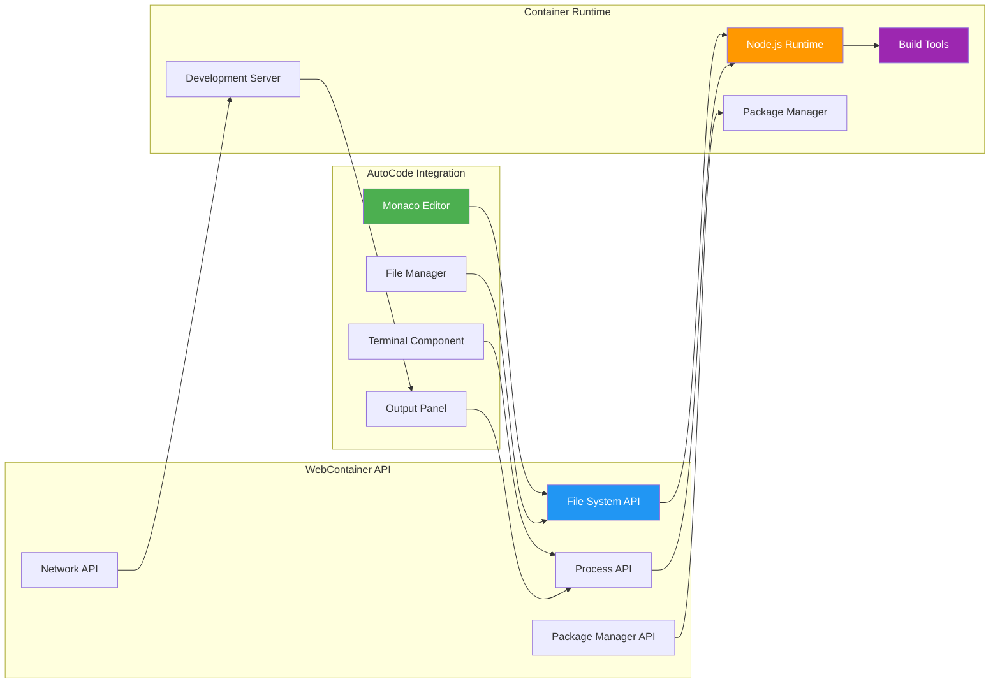

# Chapter 4: WebContainer Implementation

## Overview

WebContainer is the core technology that enables AutoCode to run code securely in the browser. This chapter explores the implementation details, architecture, and integration patterns of WebContainer technology within AutoCode.

## WebContainer Technology

### What is WebContainer?

WebContainer is a web standards-based sandbox that allows running Node.js applications directly in the browser. It provides a complete Linux environment with file system, networking, and process management capabilities.



### WebContainer Architecture



## Implementation Details

### WebContainer Initialization

```typescript
// services/WebContainerService.ts
export class WebContainerService {
  private container: WebContainer | null = null;
  private serverProcess: WebContainerProcess | null = null;
  private isInitialized = false;

  async initialize(): Promise<void> {
    try {
      // Start WebContainer
      this.container = await WebContainer.boot();

      // Setup file system watchers
      await this.setupFileSystemWatchers();

      // Setup networking
      await this.setupNetworking();

      this.isInitialized = true;
      console.log('WebContainer initialized successfully');
    } catch (error) {
      console.error('Failed to initialize WebContainer:', error);
      throw error;
    }
  }

  private async setupFileSystemWatchers(): Promise<void> {
    if (!this.container) return;

    // Watch for file changes
    this.container.on('server-ready', (port, url) => {
      console.log(`Server ready at ${url}`);
      this.notifyServerReady(url);
    });

    this.container.on('error', (error) => {
      console.error('WebContainer error:', error);
      this.notifyError(error);
    });
  }

  private async setupNetworking(): Promise<void> {
    // Configure networking policies
    // This can be extended to allow specific external resources
  }
}
```

### File System Management

```typescript
// services/FileSystemService.ts
export class FileSystemService {
  constructor(private container: WebContainer) {}

  async writeFile(path: string, content: string): Promise<void> {
    await this.container.fs.writeFile(path, content);
  }

  async readFile(path: string): Promise<string> {
    return await this.container.fs.readFile(path, 'utf-8');
  }

  async exists(path: string): Promise<boolean> {
    try {
      await this.container.fs.stat(path);
      return true;
    } catch {
      return false;
    }
  }

  async mkdir(path: string): Promise<void> {
    await this.container.fs.mkdir(path, { recursive: true });
  }

  async readdir(path: string): Promise<string[]> {
    return await this.container.fs.readdir(path);
  }

  async delete(path: string): Promise<void> {
    await this.container.fs.rm(path, { recursive: true });
  }

  async copy(source: string, destination: string): Promise<void> {
    const content = await this.readFile(source);
    await this.writeFile(destination, content);
  }

  async move(source: string, destination: string): Promise<void> {
    await this.container.fs.rename(source, destination);
  }

  // Tree operations for file explorer
  async getDirectoryTree(path: string = '/'): Promise<FileNode> {
    const buildTree = async (dirPath: string): Promise<FileNode> => {
      const entries = await this.readdir(dirPath);
      const children: FileNode[] = [];

      for (const entry of entries) {
        const entryPath = path.join(dirPath, entry);
        const stats = await this.container.fs.stat(entryPath);

        const node: FileNode = {
          name: entry,
          path: entryPath,
          type: stats.isDirectory() ? 'directory' : 'file',
          size: stats.isFile() ? stats.size : 0,
          modified: stats.mtime,
        };

        if (stats.isDirectory()) {
          node.children = await buildTree(entryPath);
        }

        children.push(node);
      }

      return {
        name: path.basename(dirPath),
        path: dirPath,
        type: 'directory',
        children: children.sort((a, b) => {
          if (a.type === 'directory' && b.type === 'file') return -1;
          if (a.type === 'file' && b.type === 'directory') return 1;
          return a.name.localeCompare(b.name);
        }),
      };
    };

    return buildTree(path);
  }
}

interface FileNode {
  name: string;
  path: string;
  type: 'file' | 'directory';
  size?: number;
  modified?: Date;
  children?: FileNode[];
}
```

### Package Management

```typescript
// services/PackageService.ts
export class PackageService {
  constructor(
    private container: WebContainer,
    private fileSystem: FileSystemService
  ) {}

  async installPackages(packages: string[], options: {
    dev?: boolean;
    global?: boolean;
    exact?: boolean;
  } = {}): Promise<InstallResult> {
    const { dev = false, global = false, exact = false } = options;

    const args = ['install', ...packages];
    if (dev) args.push('--save-dev');
    if (global) args.push('--global');
    if (exact) args.push('--save-exact');

    const installProcess = await this.container.spawn('npm', args);

    return new Promise((resolve, reject) => {
      let output = '';
      let errorOutput = '';

      installProcess.output.pipeTo(new WritableStream({
        write(data) {
          output += data;
          this.notifyOutput(data);
        }
      }));

      installProcess.stderr.pipeTo(new WritableStream({
        write(data) {
          errorOutput += data;
          this.notifyError(data);
        }
      }));

      installProcess.exit.then(({ code }) => {
        if (code === 0) {
          resolve({
            success: true,
            output,
            packages: await this.getInstalledPackages(),
          });
        } else {
          reject(new Error(`Installation failed: ${errorOutput}`));
        }
      });
    });
  }

  async getInstalledPackages(): Promise<PackageInfo[]> {
    try {
      const packageJson = await this.fileSystem.readFile('package.json');
      const parsed = JSON.parse(packageJson);

      const dependencies = parsed.dependencies || {};
      const devDependencies = parsed.devDependencies || {};

      const packages: PackageInfo[] = [];

      for (const [name, version] of Object.entries(dependencies)) {
        packages.push({ name, version, type: 'dependency' });
      }

      for (const [name, version] of Object.entries(devDependencies)) {
        packages.push({ name, version, type: 'devDependency' });
      }

      return packages;
    } catch (error) {
      console.error('Failed to read package.json:', error);
      return [];
    }
  }

  async runScript(scriptName: string): Promise<ScriptResult> {
    try {
      const packageJson = await this.fileSystem.readFile('package.json');
      const scripts = JSON.parse(packageJson).scripts || {};

      if (!scripts[scriptName]) {
        throw new Error(`Script '${scriptName}' not found in package.json`);
      }

      const process = await this.container.spawn('npm', ['run', scriptName]);

      return new Promise((resolve, reject) => {
        let output = '';
        let errorOutput = '';

        process.output.pipeTo(new WritableStream({
          write(data) {
            output += data;
            this.notifyOutput(data);
          }
        }));

        process.stderr.pipeTo(new WritableStream({
          write(data) {
            errorOutput += data;
            this.notifyError(data);
          }
        }));

        process.exit.then(({ code }) => {
          resolve({
            success: code === 0,
            output,
            error: code !== 0 ? errorOutput : undefined,
            exitCode: code,
          });
        });
      });
    } catch (error) {
      return {
        success: false,
        output: '',
        error: error.message,
        exitCode: 1,
      };
    }
  }
}

interface PackageInfo {
  name: string;
  version: string;
  type: 'dependency' | 'devDependency';
}

interface InstallResult {
  success: boolean;
  output: string;
  packages: PackageInfo[];
}

interface ScriptResult {
  success: boolean;
  output: string;
  error?: string;
  exitCode: number;
}
```

### Development Server Management

```typescript
// services/DevServerService.ts
export class DevServerService {
  private serverProcess: WebContainerProcess | null = null;
  private serverUrl: string | null = null;

  constructor(
    private container: WebContainer,
    private packageService: PackageService
  ) {}

  async startServer(options: {
    port?: number;
    script?: string;
    framework?: 'react' | 'vue' | 'angular' | 'node';
  } = {}): Promise<string> {
    const { port = 3000, script = 'dev', framework = 'node' } = options;

    // Stop existing server if running
    if (this.serverProcess) {
      await this.stopServer();
    }

    // Start the development server
    this.serverProcess = await this.container.spawn('npm', ['run', script]);

    // Wait for server to be ready
    return new Promise((resolve, reject) => {
      const timeout = setTimeout(() => {
        reject(new Error('Server startup timeout'));
      }, 30000); // 30 second timeout

      this.container.on('server-ready', (serverPort, url) => {
        if (serverPort === port) {
          clearTimeout(timeout);
          this.serverUrl = url;
          resolve(url);
        }
      });

      this.serverProcess.exit.then(({ code }) => {
        if (code !== 0) {
          clearTimeout(timeout);
          reject(new Error(`Server failed to start (exit code: ${code})`));
        }
      });
    });
  }

  async stopServer(): Promise<void> {
    if (this.serverProcess) {
      this.serverProcess.kill();
      this.serverProcess = null;
      this.serverUrl = null;
    }
  }

  async restartServer(): Promise<string> {
    await this.stopServer();
    // Restart with same configuration
    return this.startServer();
  }

  getServerUrl(): string | null {
    return this.serverUrl;
  }

  isServerRunning(): boolean {
    return this.serverProcess !== null && this.serverUrl !== null;
  }

  // Framework-specific server configurations
  private getFrameworkConfig(framework: string): FrameworkConfig {
    const configs: Record<string, FrameworkConfig> = {
      react: {
        script: 'dev',
        expectedOutput: 'Local:',
        port: 5173,
      },
      vue: {
        script: 'dev',
        expectedOutput: 'Local:',
        port: 5173,
      },
      angular: {
        script: 'start',
        expectedOutput: 'Local:',
        port: 4200,
      },
      node: {
        script: 'dev',
        expectedOutput: 'Server running',
        port: 3000,
      },
    };

    return configs[framework] || configs.node;
  }
}

interface FrameworkConfig {
  script: string;
  expectedOutput: string;
  port: number;
}
```

### Terminal Integration

```typescript
// services/TerminalService.ts
export class TerminalService {
  private processes: Map<string, WebContainerProcess> = new Map();
  private nextProcessId = 1;

  constructor(private container: WebContainer) {}

  async executeCommand(
    command: string,
    args: string[] = [],
    options: {
      cwd?: string;
      env?: Record<string, string>;
    } = {}
  ): Promise<TerminalSession> {
    const processId = `terminal-${this.nextProcessId++}`;
    const { cwd = '/', env = {} } = options;

    const process = await this.container.spawn(command, args, {
      cwd,
      env: { ...process.env, ...env },
    });

    this.processes.set(processId, process);

    const session: TerminalSession = {
      id: processId,
      command: `${command} ${args.join(' ')}`,
      cwd,
      output: '',
      error: '',
      isActive: true,
    };

    // Setup output streams
    process.output.pipeTo(new WritableStream({
      write(data) {
        session.output += data;
        this.onOutput(processId, data);
      }
    }));

    process.stderr.pipeTo(new WritableStream({
      write(data) {
        session.error += data;
        this.onError(processId, data);
      }
    }));

    process.exit.then(({ code }) => {
      session.isActive = false;
      session.exitCode = code;
      this.onExit(processId, code);
    });

    return session;
  }

  async sendInput(processId: string, input: string): Promise<void> {
    const process = this.processes.get(processId);
    if (process && process.input) {
      const writer = process.input.getWriter();
      await writer.write(input);
      writer.releaseLock();
    }
  }

  async killProcess(processId: string): Promise<void> {
    const process = this.processes.get(processId);
    if (process) {
      process.kill();
      this.processes.delete(processId);
    }
  }

  async killAllProcesses(): Promise<void> {
    for (const [processId, process] of this.processes) {
      process.kill();
    }
    this.processes.clear();
  }

  getActiveProcesses(): TerminalSession[] {
    const sessions: TerminalSession[] = [];

    for (const [processId, process] of this.processes) {
      sessions.push({
        id: processId,
        command: process.spawnArguments?.join(' ') || 'Unknown',
        cwd: process.cwd || '/',
        output: '',
        error: '',
        isActive: true,
      });
    }

    return sessions;
  }

  // Event handlers
  private onOutput(processId: string, data: string): void {
    // Emit event or call callback
    console.log(`[${processId}] Output:`, data);
  }

  private onError(processId: string, data: string): void {
    // Emit event or call callback
    console.error(`[${processId}] Error:`, data);
  }

  private onExit(processId: string, code: number): void {
    // Emit event or call callback
    console.log(`[${processId}] Exit with code:`, code);
    this.processes.delete(processId);
  }
}

interface TerminalSession {
  id: string;
  command: string;
  cwd: string;
  output: string;
  error: string;
  isActive: boolean;
  exitCode?: number;
}
```

## Integration with React Components

### WebContainer Provider

```typescript
// context/WebContainerContext.tsx
interface WebContainerContextType {
  isInitialized: boolean;
  isLoading: boolean;
  error: string | null;
  fileSystem: FileSystemService | null;
  packageService: PackageService | null;
  devServer: DevServerService | null;
  terminal: TerminalService | null;
  initialize: () => Promise<void>;
  reset: () => Promise<void>;
}

const WebContainerContext = createContext<WebContainerContextType | null>(null);

export const WebContainerProvider: React.FC<{ children: React.ReactNode }> = ({
  children,
}) => {
  const [isInitialized, setIsInitialized] = useState(false);
  const [isLoading, setIsLoading] = useState(false);
  const [error, setError] = useState<string | null>(null);
  const [container, setContainer] = useState<WebContainer | null>(null);

  const fileSystem = useMemo(
    () => container ? new FileSystemService(container) : null,
    [container]
  );

  const packageService = useMemo(
    () => container && fileSystem ? new PackageService(container, fileSystem) : null,
    [container, fileSystem]
  );

  const devServer = useMemo(
    () => container && packageService ? new DevServerService(container, packageService) : null,
    [container, packageService]
  );

  const terminal = useMemo(
    () => container ? new TerminalService(container) : null,
    [container]
  );

  const initialize = useCallback(async () => {
    if (isInitialized) return;

    setIsLoading(true);
    setError(null);

    try {
      const webContainer = await WebContainer.boot();
      setContainer(webContainer);
      setIsInitialized(true);
    } catch (err) {
      setError(err instanceof Error ? err.message : 'Failed to initialize WebContainer');
    } finally {
      setIsLoading(false);
    }
  }, [isInitialized]);

  const reset = useCallback(async () => {
    if (container) {
      await container.teardown();
      setContainer(null);
      setIsInitialized(false);
      setError(null);
    }
  }, [container]);

  const value: WebContainerContextType = {
    isInitialized,
    isLoading,
    error,
    fileSystem,
    packageService,
    devServer,
    terminal,
    initialize,
    reset,
  };

  return (
    <WebContainerContext.Provider value={value}>
      {children}
    </WebContainerContext.Provider>
  );
};

export const useWebContainer = (): WebContainerContextType => {
  const context = useContext(WebContainerContext);
  if (!context) {
    throw new Error('useWebContainer must be used within WebContainerProvider');
  }
  return context;
};
```

### File Explorer Component

```typescript
// components/FileExplorer.tsx
interface FileExplorerProps {
  onFileSelect: (file: FileNode) => void;
  onFileCreate: (path: string) => void;
  onFileDelete: (path: string) => void;
  onFileRename: (oldPath: string, newPath: string) => void;
}

export const FileExplorer: React.FC<FileExplorerProps> = ({
  onFileSelect,
  onFileCreate,
  onFileDelete,
  onFileRename,
}) => {
  const { fileSystem, isInitialized } = useWebContainer();
  const [fileTree, setFileTree] = useState<FileNode | null>(null);
  const [expandedNodes, setExpandedNodes] = useState<Set<string>>(new Set());
  const [selectedPath, setSelectedPath] = useState<string | null>(null);

  useEffect(() => {
    if (isInitialized && fileSystem) {
      loadFileTree();
    }
  }, [isInitialized, fileSystem]);

  const loadFileTree = async () => {
    if (!fileSystem) return;

    try {
      const tree = await fileSystem.getDirectoryTree();
      setFileTree(tree);
    } catch (error) {
      console.error('Failed to load file tree:', error);
    }
  };

  const toggleNode = (path: string) => {
    setExpandedNodes((prev) => {
      const next = new Set(prev);
      if (next.has(path)) {
        next.delete(path);
      } else {
        next.add(path);
      }
      return next;
    });
  };

  const handleFileSelect = (node: FileNode) => {
    if (node.type === 'file') {
      setSelectedPath(node.path);
      onFileSelect(node);
    } else {
      toggleNode(node.path);
    }
  };

  const renderFileNode = (node: FileNode, depth: number = 0): React.ReactNode => {
    const isExpanded = expandedNodes.has(node.path);
    const isSelected = selectedPath === node.path;

    return (
      <div key={node.path}>
        <div
          className={`file-node ${isSelected ? 'selected' : ''}`}
          style={{ paddingLeft: `${depth * 20}px` }}
          onClick={() => handleFileSelect(node)}
        >
          <span className="file-icon">
            {node.type === 'directory' ? (isExpanded ? '📂' : '📁') : '📄'}
          </span>
          <span className="file-name">{node.name}</span>
        </div>
        {node.type === 'directory' && isExpanded && node.children && (
          <div>
            {node.children.map((child) => renderFileNode(child, depth + 1))}
          </div>
        )}
      </div>
    );
  };

  if (!isInitialized) {
    return <div className="file-explorer-loading">Initializing...</div>;
  }

  if (!fileTree) {
    return <div className="file-explorer-empty">No files</div>;
  }

  return (
    <div className="file-explorer">
      <div className="file-explorer-header">
        <h3>Files</h3>
        <button onClick={() => onFileCreate('/')} className="new-file-btn">
          + New File
        </button>
      </div>
      <div className="file-tree">
        {renderFileNode(fileTree)}
      </div>
    </div>
  );
};
```

## Performance Optimizations

### File System Caching

```typescript
// services/CachedFileSystemService.ts
export class CachedFileSystemService extends FileSystemService {
  private cache = new Map<string, CacheEntry>();
  private cacheTimeout = 5000; // 5 seconds

  async readFile(path: string): Promise<string> {
    const cached = this.cache.get(path);
    if (cached && Date.now() - cached.timestamp < this.cacheTimeout) {
      return cached.data;
    }

    const content = await super.readFile(path);
    this.cache.set(path, {
      data: content,
      timestamp: Date.now(),
    });

    return content;
  }

  async writeFile(path: string, content: string): Promise<void> {
    await super.writeFile(path, content);

    // Invalidate cache
    this.cache.delete(path);

    // Invalidate parent directory cache
    const parentPath = path.split('/').slice(0, -1).join('/');
    this.cache.delete(parentPath);
  }

  private clearExpiredCache(): void {
    const now = Date.now();
    for (const [key, entry] of this.cache) {
      if (now - entry.timestamp > this.cacheTimeout) {
        this.cache.delete(key);
      }
    }
  }
}

interface CacheEntry {
  data: string;
  timestamp: number;
}
```

### Lazy Loading

```typescript
// hooks/useLazyFileSystem.ts
export const useLazyFileSystem = () => {
  const [loadedFiles, setLoadedFiles] = useState<Set<string>>(new Set());
  const { fileSystem } = useWebContainer();

  const loadFile = useCallback(async (path: string) => {
    if (loadedFiles.has(path)) return;

    try {
      await fileSystem?.readFile(path);
      setLoadedFiles((prev) => new Set([...prev, path]));
    } catch (error) {
      console.error(`Failed to load file ${path}:`, error);
    }
  }, [fileSystem, loadedFiles]);

  const preloadDirectory = useCallback(async (directory: string) => {
    if (!fileSystem) return;

    const files = await fileSystem.readdir(directory);
    const promises = files.map((file) =>
      loadFile(`${directory}/${file}`)
    );

    await Promise.all(promises);
  }, [fileSystem, loadFile]);

  return {
    loadFile,
    preloadDirectory,
    isFileLoaded: (path: string) => loadedFiles.has(path),
  };
};
```

## Security Considerations

### Resource Limits

```typescript
// services/SecureWebContainerService.ts
export class SecureWebContainerService extends WebContainerService {
  private readonly maxFileSize = 10 * 1024 * 1024; // 10MB
  private readonly maxFiles = 1000;
  private readonly allowedCommands = [
    'node', 'npm', 'yarn', 'pnpm', 'python', 'python3', 'git'
  ];

  async initialize(): Promise<void> {
    await super.initialize();

    // Set resource limits
    await this.setResourceLimits();
  }

  private async setResourceLimits(): Promise<void> {
    // This would use WebContainer API to set limits
    // Implementation depends on WebContainer API capabilities
  }

  async validateCommand(command: string): Promise<boolean> {
    const baseCommand = command.split(' ')[0];
    return this.allowedCommands.includes(baseCommand);
  }

  async validateFileSize(size: number): Promise<boolean> {
    return size <= this.maxFileSize;
  }

  async validateFileCount(count: number): Promise<boolean> {
    return count <= this.maxFiles;
  }
}
```

## Chapter Summary

In this chapter, we've explored the comprehensive implementation of WebContainer technology in AutoCode:

- ✅ **WebContainer architecture** and its integration with AutoCode
- ✅ **File system management** with virtual file operations
- ✅ **Package management** supporting npm, yarn, and pnpm
- ✅ **Development server management** for different frameworks
- ✅ **Terminal integration** for command execution
- ✅ **React component integration** with WebContainer services
- ✅ **Performance optimizations** including caching and lazy loading
- ✅ **Security considerations** with resource limits and validation

### Key Implementation Highlights

1. **Modular Service Architecture**: Clean separation of concerns with dedicated services
2. **React Integration**: Seamless integration with React components using Context API
3. **Performance Optimization**: Caching and lazy loading for better user experience
4. **Security**: Resource limits and command validation for secure execution
5. **Framework Support**: Extensible architecture supporting multiple frameworks

> **🔑 Key Takeaway:** WebContainer implementation in AutoCode provides a secure, performant, and feature-rich environment for running code directly in the browser, enabling powerful development experiences without local setup.

---

**Next Chapter:** [AI Integration with OpenRouter](./05-ai-integration.md) → Explore the AI-powered features that make AutoCode an intelligent coding assistant.