# Chapter 4: WebContainer Implementation

## Overview

WebContainer is the core technology that enables AutoCode to run code securely in the browser. This chapter explores the actual implementation details, architecture, and integration patterns of WebContainer technology within AutoCode, based on the real codebase implementation.

## WebContainer Technology in AutoCode

### What is WebContainer?

WebContainer is a web standards-based sandbox that allows running Node.js applications directly in the browser. It provides a complete Linux environment with file system, networking, and process management capabilities, all within the browser's security boundaries.

```mermaid
graph TB
    subgraph "Browser Environment"
        MainThread[Main Thread<br/>React UI + Vite]
        WebContainerThread[WebContainer Thread<br/>Isolated Environment]
        GlobalState[Global State<br/>window.__WEBCONTAINER_*]
    end

    subgraph "AutoCode Integration"
        WebContainerProvider[WebContainerProvider<br/>Singleton Pattern]
        MonacoEditor[Monaco Editor<br/>VS Code Editor]
        FileOperations[AI File Operations<br/>Enhanced AI Service]
        ChatBot[Enhanced ChatBot<br/>AI Assistant]
    end

    subgraph "WebContainer Runtime"
        VirtualFS[Virtual File System<br/>Container File System]
        NodeRuntime[Node.js Runtime<br/>Browser-based]
        PackageManagement[Package Manager<br/>npm support]
        ProcessExecution[Process Manager<br/>Command Execution]
    end

    subgraph "Security Layer"
        BrowserSandbox[Browser Sandbox<br/>Native Security]
        ProcessIsolation[Process Isolation<br/>Memory Protection]
        NetworkLimits[Network Policies<br/>Restricted Access]
        ResourceConstraints[Resource Limits<br/>Memory/CPU]
    end

    MainThread --> WebContainerProvider
    WebContainerProvider --> GlobalState
    GlobalState --> WebContainerThread

    WebContainerThread --> VirtualFS
    WebContainerThread --> NodeRuntime
    WebContainerThread --> PackageManagement
    WebContainerThread --> ProcessExecution

    MonacoEditor --> VirtualFS
    FileOperations --> VirtualFS
    ChatBot --> FileOperations

    WebContainerThread --> BrowserSandbox
    BrowserSandbox --> ProcessIsolation
    ProcessIsolation --> NetworkLimits
    NetworkLimits --> ResourceConstraints

    style MainThread fill:#61DAFB,color:#fff
    style WebContainerProvider fill:#007ACC,color:#fff
    style MonacoEditor fill:#4CAF50,color:#fff
    style VirtualFS fill:#FF6B35,color:#fff
    style BrowserSandbox fill:#9C27B0,color:#fff
```



### Actual WebContainer Architecture in AutoCode

```mermaid
graph TB
    subgraph "React Application (client/src/)"
        App[App.tsx<br/>Main Component]
        WebContainerProvider[WebContainerProvider.tsx<br/>Singleton Manager]
        EnhancedChatBot[Enhanced ChatBot<br/>AI + File Operations]
    end

    subgraph "WebContainer API Integration"
        WebContainerAPI[@webcontainer/api<br/>Official Package]
        SingletonClass[WebContainerSingleton<br/>Global Instance Manager]
        GlobalWindow[window.__WEBCONTAINER_*<br/>Browser Global State]
    end

    subgraph "WebContainer Runtime"
        NodeJSEnv[Node.js Environment<br/>Full Runtime]
        FileSystem[Virtual File System<br/>Container FS]
        PackageMGR[npm Support<br/>Package Management]
        DevServer[Dev Server<br/>Hot Reload]
    end

    subgraph "AI Integration"
        OpenRouterService[OpenRouter Service<br/>AI Models]
        AIFileOperations[AI File Operations<br/>Create/Modify/Delete]
        StreamingResponses[Streaming Chat<br/>Real-time AI]
    end

    App --> WebContainerProvider
    WebContainerProvider --> EnhancedChatBot

    WebContainerProvider --> WebContainerAPI
    WebContainerAPI --> SingletonClass
    SingletonClass --> GlobalWindow

    GlobalWindow --> NodeJSEnv
    NodeJSEnv --> FileSystem
    NodeJSEnv --> PackageMGR
    NodeJSEnv --> DevServer

    EnhancedChatBot --> OpenRouterService
    OpenRouterService --> AIFileOperations
    AIFileOperations --> FileSystem

    style App fill:#61DAFB,color:#fff
    style WebContainerProvider fill:#007ACC,color:#fff
    style EnhancedChatBot fill:#FF6B35,color:#fff
    style SingletonClass fill:#9C27B0,color:#fff
    style NodeJSEnv fill:#4CAF50,color:#fff
    style AIFileOperations fill:#2196F3,color:#fff
```

## Actual Implementation Details

### WebContainer Singleton Pattern (WebContainerProvider.tsx)

The actual WebContainer implementation uses a sophisticated singleton pattern to ensure exactly one instance per browser tab, even with React StrictMode and hot reloading:

```typescript
// client/src/providers/WebContainerProvider.tsx - Actual Implementation
declare global {
  interface Window {
    __WEBCONTAINER_INSTANCE__?: WebContainer;
    __WEBCONTAINER_BOOT_PROMISE__?: Promise<WebContainer>;
    __WEBCONTAINER_BOOTING__?: boolean;
  }
}

class WebContainerSingleton {
  /**
   * Get or boot the WebContainer instance (singleton pattern)
   * Thread-safe: multiple concurrent calls will wait for the same boot
   */
  static async getInstance(): Promise<WebContainer> {
    const timestamp = Date.now();

    // If already booted globally, return existing instance
    if (window.__WEBCONTAINER_INSTANCE__) {
      console.log(`[${timestamp}] ✅ Returning existing global instance`);
      return window.__WEBCONTAINER_INSTANCE__;
    }

    // If boot in progress globally, wait for it
    if (window.__WEBCONTAINER_BOOT_PROMISE__) {
      console.log(`[${timestamp}] ⏳ Global boot in progress, waiting...`);
      return window.__WEBCONTAINER_BOOT_PROMISE__;
    }

    // If already booting (race condition guard), wait a bit and retry
    if (window.__WEBCONTAINER_BOOTING__) {
      console.log(`[${timestamp}] 🔒 Boot flag set, waiting 100ms...`);
      await new Promise(resolve => setTimeout(resolve, 100));
      return this.getInstance(); // Retry
    }

    // Start boot process
    window.__WEBCONTAINER_BOOTING__ = true;
    console.log(`[${timestamp}] 🚀 Starting WebContainer boot (GLOBAL)...`);

    window.__WEBCONTAINER_BOOT_PROMISE__ = (async () => {
      try {
        const instance = await WebContainer.boot();
        window.__WEBCONTAINER_INSTANCE__ = instance;
        window.__WEBCONTAINER_BOOTING__ = false;
        console.log(`[${timestamp}] ✅ WebContainer booted successfully (GLOBAL)!`);
        return instance;
      } catch (error) {
        window.__WEBCONTAINER_BOOTING__ = false;
        window.__WEBCONTAINER_BOOT_PROMISE__ = undefined;
        console.error(`[${timestamp}] ❌ Failed to boot WebContainer (GLOBAL):`, error);
        throw error;
      }
    })();

    return window.__WEBCONTAINER_BOOT_PROMISE__;
  }

  /**
   * Reset the singleton (useful for testing or manual retry)
   * DANGEROUS: Only use if you know what you're doing
   */
  static reset(): void {
    console.warn('🔄 Resetting WebContainer singleton (GLOBAL)');
    window.__WEBCONTAINER_INSTANCE__ = undefined;
    window.__WEBCONTAINER_BOOT_PROMISE__ = undefined;
    window.__WEBCONTAINER_BOOTING__ = false;
  }
}
```

### React Provider Integration

```typescript
// client/src/providers/WebContainerProvider.tsx - React Integration
export const WebContainerProvider: React.FC<WebContainerProviderProps> = ({ children }) => {
  const [webcontainer, setWebcontainer] = useState<WebContainer | null>(null);
  const [isBooting, setIsBooting] = useState(true);
  const [bootError, setBootError] = useState<Error | null>(null);

  useEffect(() => {
    let mounted = true;
    const componentId = Math.random().toString(36).substring(7);
    console.log(`[Provider ${componentId}] 🔄 Component mounted, starting boot process`);

    async function bootContainer() {
      try {
        console.log(`[Provider ${componentId}] 📞 Calling WebContainerSingleton.getInstance()`);
        const instance = await WebContainerSingleton.getInstance();

        if (mounted) {
          console.log(`[Provider ${componentId}] ✅ Got instance, updating state`);
          setWebcontainer(instance);
          setIsBooting(false);
        } else {
          console.log(`[Provider ${componentId}] ⚠️ Component unmounted, skipping state update`);
        }
      } catch (error) {
        console.error(`[Provider ${componentId}] ❌ Boot error:`, error);
        if (mounted) {
          setBootError(error as Error);
          setIsBooting(false);
        }
      }
    }

    bootContainer();

    return () => {
      mounted = false;
      console.log(`[Provider ${componentId}] 🗑️ Component unmounted`);
      // Note: WebContainer singleton persists for page lifetime
    };
  }, []); // Empty deps - only boot once per provider lifecycle

  return (
    <WebContainerContext.Provider value={{ webcontainer, isBooting, bootError }}>
      {children}
    </WebContainerContext.Provider>
  );
};

export const useWebContainerInstance = () => useContext(WebContainerContext);
```

### Key Features of the Actual Implementation

#### 1. Global State Management
- Uses `window.__WEBCONTAINER_*` properties to manage singleton state
- Persists across React component re-renders and hot module replacement
- Handles React StrictMode double-mounting gracefully

#### 2. Race Condition Protection
- Multiple concurrent calls to `getInstance()` wait for the same boot process
- Boot flag prevents multiple simultaneous boot attempts
- Automatic retry mechanism for race conditions

#### 3. Comprehensive Logging
- Timestamped logs for debugging boot process
- Clear status indicators (🚀 booting, ✅ success, ❌ error, ⏳ waiting)
- Component-level logging with unique IDs for tracking

#### 4. Error Handling
- Proper cleanup on boot failure
- Error state management in React context
- Graceful degradation for component unmounting during boot

### AI File Operations Integration

The WebContainer is tightly integrated with AI file operations, allowing the AI assistant to create, modify, and delete files within the secure container environment:

```typescript
// client/src/services/aiFileOperations.ts - Actual AI Integration
export class AIFileOperations {
  constructor(
    private webcontainer: WebContainer,
    private enhancedAIService: EnhancedAIService
  ) {}

  async createFileFromAI(
    fileName: string,
    content: string,
    context: string = ''
  ): Promise<{ success: boolean; message: string; path: string }> {
    try {
      // AI validates and potentially enhances the content
      const enhancedContent = await this.enhancedAIService.enhanceFileContent(
        content,
        fileName,
        context
      );

      // Create file in WebContainer virtual file system
      await this.webcontainer.fs.writeFile(fileName, enhancedContent);

      return {
        success: true,
        message: `Successfully created ${fileName}`,
        path: fileName
      };
    } catch (error) {
      return {
        success: false,
        message: `Failed to create ${fileName}: ${error.message}`,
        path: fileName
      };
    }
  }

  async modifyFileFromAI(
    filePath: string,
    instruction: string,
    currentContent: string
  ): Promise<{ success: boolean; message: string; newContent: string }> {
    try {
      // AI processes the modification instruction
      const modification = await this.enhancedAIService.processFileModification(
        currentContent,
        instruction,
        filePath
      );

      // Update file in WebContainer
      await this.webcontainer.fs.writeFile(filePath, modification.newContent);

      return {
        success: true,
        message: `Successfully modified ${filePath}`,
        newContent: modification.newContent
      };
    } catch (error) {
      return {
        success: false,
        message: `Failed to modify ${filePath}: ${error.message}`,
        newContent: currentContent
      };
    }
  }

  async deleteFileFromAI(
    filePath: string,
    reason: string
  ): Promise<{ success: boolean; message: string }> {
    try {
      // AI validates deletion request
      const validation = await this.enhancedAIService.validateFileDeletion(
        filePath,
        reason
      );

      if (!validation.shouldDelete) {
        return {
          success: false,
          message: `AI recommends not deleting ${filePath}: ${validation.reason}`
        };
      }

      // Delete file from WebContainer
      await this.webcontainer.fs.rm(filePath, { recursive: true });

      return {
        success: true,
        message: `Successfully deleted ${filePath}: ${validation.reason}`
      };
    } catch (error) {
      return {
        success: false,
        message: `Failed to delete ${filePath}: ${error.message}`
      };
    }
  }

  async executeAICommand(
    command: string,
    description: string
  ): Promise<{ success: boolean; output: string; error?: string }> {
    try {
      // AI validates and potentially modifies the command for safety
      const validatedCommand = await this.enhancedAIService.validateCommand(command);

      // Execute command in WebContainer
      const process = await this.webcontainer.spawn('sh', ['-c', validatedCommand]);

      let output = '';
      let errorOutput = '';

      process.output.pipeTo(new WritableStream({
        write(data) { output += data; }
      }));

      process.stderr.pipeTo(new WritableStream({
        write(data) { errorOutput += data; }
      }));

      const exitCode = (await process.exit).code;

      return {
        success: exitCode === 0,
        output,
        error: exitCode !== 0 ? errorOutput : undefined
      };
    } catch (error) {
      return {
        success: false,
        output: '',
        error: error.message
      };
    }
  }
}
```

### WebContainer Context Interface

```typescript
// client/src/providers/WebContainerProvider.tsx - Context Interface
interface WebContainerContextType {
  webcontainer: WebContainer | null;
  isBooting: boolean;
  bootError: Error | null;
}

const WebContainerContext = createContext<WebContainerContextType>({
  webcontainer: null,
  isBooting: true,
  bootError: null,
});

/**
 * Custom hook to access WebContainer instance
 * @returns WebContainer context with instance, boot status, and errors
 */
export const useWebContainerInstance = () => useContext(WebContainerContext);
```

### Integration with Enhanced Chat Store

The WebContainer integrates with the AI chat system to provide file operations and code execution capabilities:

```typescript
// client/src/store/enhancedChatStore.ts - WebContainer Integration
interface ChatState {
  // ... other chat state properties

  // WebContainer integration
  webContainerInstance: WebContainer | null;
  aiFileOperations: AIFileOperations | null;

  // Actions
  initializeWebContainer: () => Promise<void>;
  executeAIFileOperation: (operation: FileOperation) => Promise<void>;
}

interface FileOperation {
  type: 'create' | 'modify' | 'delete' | 'execute';
  fileName?: string;
  content?: string;
  instruction?: string;
  command?: string;
  context?: string;
}

export const useChatStore = create<ChatState>((set, get) => ({
  // ... other state initialization

  webContainerInstance: null,
  aiFileOperations: null,

  initializeWebContainer: async () => {
    try {
      const instance = await WebContainerSingleton.getInstance();
      const aiOperations = new AIFileOperations(instance, enhancedAIService);

      set({
        webContainerInstance: instance,
        aiFileOperations: aiOperations
      });
    } catch (error) {
      console.error('Failed to initialize WebContainer:', error);
    }
  },

  executeAIFileOperation: async (operation: FileOperation) => {
    const { aiFileOperations } = get();
    if (!aiFileOperations) return;

    let result;
    switch (operation.type) {
      case 'create':
        result = await aiFileOperations.createFileFromAI(
          operation.fileName!,
          operation.content!,
          operation.context
        );
        break;
      case 'modify':
        result = await aiFileOperations.modifyFileFromAI(
          operation.fileName!,
          operation.instruction!,
          operation.content!
        );
        break;
      case 'delete':
        result = await aiFileOperations.deleteFileFromAI(
          operation.fileName!,
          operation.instruction!
        );
        break;
      case 'execute':
        result = await aiFileOperations.executeAICommand(
          operation.command!,
          operation.instruction!
        );
        break;
    }

    // Update chat with operation result
    set(state => ({
      messages: [...state.messages, {
        id: Date.now().toString(),
        role: 'assistant',
        content: `File operation ${result.success ? 'succeeded' : 'failed'}: ${result.message}`,
        timestamp: new Date()
      }]
    }));
  }
}));
```

## WebContainer Integration Flow

### Application Startup Flow


### AI File Operations Flow


## Performance and Resource Management

### Memory Management


### Browser Compatibility and Requirements


## Chapter Summary

In this chapter, we've explored the actual WebContainer implementation in AutoCode based on the real codebase:

- ✅ **WebContainer Singleton Pattern**: Sophisticated singleton implementation ensuring exactly one instance per browser tab
- ✅ **React Integration**: Seamless integration with React components using Context API and custom hooks
- ✅ **AI File Operations**: Deep integration with AI services for intelligent file creation, modification, and deletion
- ✅ **Global State Management**: Browser-level state persistence across React re-renders and hot module replacement
- ✅ **Race Condition Protection**: Thread-safe implementation handling concurrent access and boot processes
- ✅ **Error Handling**: Comprehensive error handling with proper cleanup and graceful degradation
- ✅ **Performance Optimization**: Memory management, lazy loading, and resource optimization
- ✅ **Security Architecture**: Browser sandbox integration and secure AI command validation

### Key Implementation Highlights

1. **Robust Singleton Pattern**: Handles React StrictMode, hot reloading, and concurrent access
2. **AI-Powered File Operations**: Intelligent file management with AI validation and enhancement
3. **Comprehensive Logging**: Detailed logging system for debugging and monitoring
4. **Browser Compatibility**: Support for modern browsers with proper security headers
5. **Memory Management**: Efficient resource usage with proper cleanup and garbage collection

### Technical Benefits

- **🔒 Security**: Complete sandbox isolation within browser security boundaries
- **⚡ Performance**: Optimized boot process with memory efficiency and caching
- **🧠 AI Integration**: Intelligent file operations powered by AI services
- **🔄 Reliability**: Robust error handling and recovery mechanisms
- **📈 Scalability**: Efficient resource management supporting multiple concurrent operations

> **🔑 Key Takeaway:** AutoCode's WebContainer implementation represents a sophisticated integration of browser-based virtualization with AI-powered development tools, creating a secure and efficient development environment that runs entirely in the browser.

---

**Next Chapter:** [AI Integration with OpenRouter](./05-ai-integration.md) → Explore the AI-powered features that make AutoCode an intelligent coding assistant.