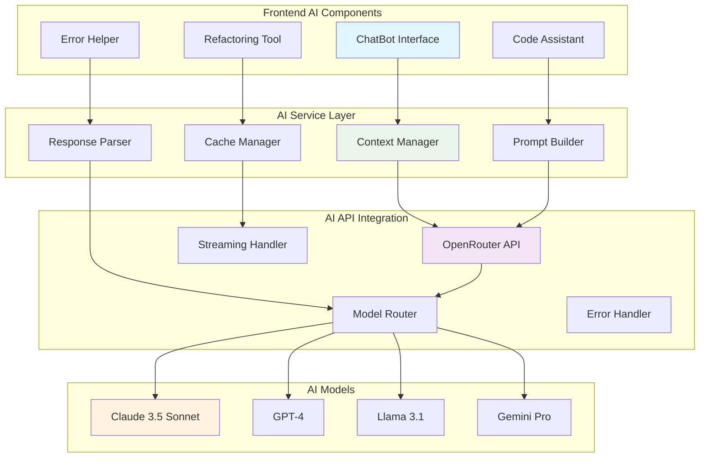

# Chapter 5: AI Integration with OpenRouter

## Overview

AutoCode's AI integration transforms it from a simple code editor into an intelligent development assistant. This chapter explores the comprehensive AI architecture, OpenRouter API integration, and the various AI-powered features that enhance the coding experience.

## AI Architecture Overview



## OpenRouter API Integration

### Service Architecture

```typescript
// services/OpenRouterService.ts
export interface OpenRouterConfig {
  apiKey: string;
  baseUrl: string;
  defaultModel: string;
  timeout: number;
  maxRetries: number;
}

export interface ChatMessage {
  role: 'system' | 'user' | 'assistant';
  content: string;
  timestamp?: Date;
}

export interface AIResponse {
  content: string;
  model: string;
  usage: {
    prompt_tokens: number;
    completion_tokens: number;
    total_tokens: number;
  };
  finish_reason: string;
}

export class OpenRouterService {
  private config: OpenRouterConfig;
  private contextCache = new Map<string, any>();

  constructor(config: OpenRouterConfig) {
    this.config = config;
  }

  async sendMessage(
    messages: ChatMessage[],
    options: {
      model?: string;
      temperature?: number;
      maxTokens?: number;
      stream?: boolean;
    } = {}
  ): Promise<AIResponse> {
    const {
      model = this.config.defaultModel,
      temperature = 0.7,
      maxTokens = 4000,
      stream = false
    } = options;

    try {
      const response = await fetch(`${this.config.baseUrl}/chat/completions`, {
        method: 'POST',
        headers: {
          'Authorization': `Bearer ${this.config.apiKey}`,
          'Content-Type': 'application/json',
          'HTTP-Referer': window.location.origin,
          'X-Title': 'AutoCode AI Assistant'
        },
        body: JSON.stringify({
          model,
          messages,
          temperature,
          max_tokens: maxTokens,
          stream
        })
      });

      if (!response.ok) {
        throw new Error(`OpenRouter API error: ${response.statusText}`);
      }

      const data = await response.json();
      return this.parseResponse(data);
    } catch (error) {
      console.error('OpenRouter API error:', error);
      throw error;
    }
  }

  async sendMessageStream(
    messages: ChatMessage[],
    options: {
      model?: string;
      temperature?: number;
      maxTokens?: number;
      onChunk?: (chunk: string) => void;
    } = {}
  ): Promise<AIResponse> {
    const { onChunk, ...restOptions } = options;

    try {
      const response = await fetch(`${this.config.baseUrl}/chat/completions`, {
        method: 'POST',
        headers: {
          'Authorization': `Bearer ${this.config.apiKey}`,
          'Content-Type': 'application/json',
          'HTTP-Referer': window.location.origin,
          'X-Title': 'AutoCode AI Assistant'
        },
        body: JSON.stringify({
          model: restOptions.model || this.config.defaultModel,
          messages,
          temperature: restOptions.temperature || 0.7,
          max_tokens: restOptions.maxTokens || 4000,
          stream: true
        })
      });

      if (!response.ok) {
        throw new Error(`OpenRouter API error: ${response.statusText}`);
      }

      return await this.handleStreamResponse(response, onChunk);
    } catch (error) {
      console.error('OpenRouter streaming error:', error);
      throw error;
    }
  }

  private async handleStreamResponse(
    response: Response,
    onChunk?: (chunk: string) => void
  ): Promise<AIResponse> {
    const reader = response.body!.getReader();
    const decoder = new TextDecoder();
    let fullContent = '';
    let usage: any = {};
    let model = '';

    try {
      while (true) {
        const { done, value } = await reader.read();
        if (done) break;

        const chunk = decoder.decode(value);
        const lines = chunk.split('\n').filter(line => line.trim());

        for (const line of lines) {
          if (line.startsWith('data: ')) {
            const data = line.slice(6);
            if (data === '[DONE]') continue;

            try {
              const parsed = JSON.parse(data);
              const delta = parsed.choices[0]?.delta;

              if (delta?.content) {
                fullContent += delta.content;
                onChunk?.(delta.content);
              }

              if (parsed.usage) {
                usage = parsed.usage;
              }

              if (parsed.model) {
                model = parsed.model;
              }
            } catch (e) {
              // Ignore JSON parsing errors for streaming chunks
            }
          }
        }
      }
    } finally {
      reader.releaseLock();
    }

    return {
      content: fullContent,
      model,
      usage: usage || {
        prompt_tokens: 0,
        completion_tokens: 0,
        total_tokens: 0
      },
      finish_reason: 'stop'
    };
  }

  private parseResponse(data: any): AIResponse {
    const choice = data.choices[0];
    return {
      content: choice.message.content,
      model: data.model,
      usage: data.usage,
      finish_reason: choice.finish_reason
    };
  }
}
```

### Context Management

```typescript
// services/AIContextManager.ts
export interface AIContext {
  workspaceId: string;
  activeFile?: {
    path: string;
    content: string;
    language: string;
    cursorPosition?: number;
    selection?: string;
  };
  projectStructure: {
    files: Array<{
      path: string;
      type: 'file' | 'directory';
      size?: number;
      language?: string;
    }>;
    dependencies: Record<string, string>;
  };
  recentActivity: Array<{
    type: 'edit' | 'create' | 'delete';
    file: string;
    timestamp: Date;
  }>;
  userPreferences: {
    preferredLanguage: string;
    codeStyle: string;
    aiModel: string;
  };
}

export class AIContextManager {
  private contextCache = new Map<string, AIContext>();
  private contextTimeout = 5 * 60 * 1000; // 5 minutes

  async buildContext(
    workspaceId: string,
    activeFile?: string,
    selectedCode?: string
  ): Promise<AIContext> {
    const cacheKey = `${workspaceId}-${activeFile || ''}`;
    const cached = this.contextCache.get(cacheKey);

    if (cached && Date.now() - this.getContextTimestamp(cacheKey) < this.contextTimeout) {
      return cached;
    }

    const context: AIContext = {
      workspaceId,
      projectStructure: await this.getProjectStructure(workspaceId),
      recentActivity: await this.getRecentActivity(workspaceId),
      userPreferences: await this.getUserPreferences(workspaceId)
    };

    if (activeFile) {
      context.activeFile = await this.getActiveFileContext(activeFile, selectedCode);
    }

    this.contextCache.set(cacheKey, context);
    this.setContextTimestamp(cacheKey);

    return context;
  }

  private async getProjectStructure(workspaceId: string): Promise<AIContext['projectStructure']> {
    // Implementation would fetch from file system service
    return {
      files: [],
      dependencies: {}
    };
  }

  private async getActiveFileContext(
    filePath: string,
    selectedCode?: string
  ): Promise<AIContext['activeFile']> {
    // Implementation would fetch from file system service
    return {
      path: filePath,
      content: '',
      language: this.getLanguageFromPath(filePath),
      selection: selectedCode
    };
  }

  private getLanguageFromPath(filePath: string): string {
    const extension = filePath.split('.').pop()?.toLowerCase();
    const languageMap: Record<string, string> = {
      'js': 'javascript',
      'ts': 'typescript',
      'jsx': 'react',
      'tsx': 'react',
      'py': 'python',
      'java': 'java',
      'cpp': 'cpp',
      'c': 'c',
      'cs': 'csharp',
      'php': 'php',
      'rb': 'ruby',
      'go': 'go',
      'rs': 'rust',
      'sql': 'sql',
      'html': 'html',
      'css': 'css',
      'scss': 'scss',
      'json': 'json',
      'xml': 'xml',
      'yaml': 'yaml',
      'md': 'markdown'
    };

    return languageMap[extension || ''] || 'text';
  }

  private async getRecentActivity(workspaceId: string): Promise<AIContext['recentActivity']> {
    // Implementation would fetch from activity tracking service
    return [];
  }

  private async getUserPreferences(workspaceId: string): Promise<AIContext['userPreferences']> {
    // Implementation would fetch from user settings service
    return {
      preferredLanguage: 'typescript',
      codeStyle: 'prettier',
      aiModel: 'anthropic/claude-3.5-sonnet'
    };
  }

  private getContextTimestamp(key: string): number {
    return this.contextCache.get(key + '_timestamp') as any || 0;
  }

  private setContextTimestamp(key: string): void {
    this.contextCache.set(key + '_timestamp', Date.now() as any);
  }
}
```

## AI-Powered Features

### Code Generation

```typescript
// services/AICodeGenerationService.ts
export interface CodeGenerationRequest {
  description: string;
  context: AIContext;
  language: string;
  framework?: string;
  style?: string;
}

export interface GeneratedCode {
  code: string;
  explanation: string;
  imports: string[];
  exports: string[];
  dependencies: string[];
  suggestions: string[];
}

export class AICodeGenerationService {
  constructor(
    private openRouter: OpenRouterService,
    private contextManager: AIContextManager
  ) {}

  async generateCode(request: CodeGenerationRequest): Promise<GeneratedCode> {
    const prompt = this.buildCodeGenerationPrompt(request);

    try {
      const response = await this.openRouter.sendMessage([
        {
          role: 'system',
          content: this.getSystemPrompt('code_generation')
        },
        {
          role: 'user',
          content: prompt
        }
      ], {
        model: request.context.userPreferences.aiModel,
        temperature: 0.3,
        maxTokens: 4000
      });

      return this.parseGeneratedCode(response.content, request.language);
    } catch (error) {
      console.error('Code generation failed:', error);
      throw error;
    }
  }

  private buildCodeGenerationPrompt(request: CodeGenerationRequest): string {
    const { description, context, language, framework, style } = request;

    let prompt = `Generate ${language} code for the following description:\n\n${description}\n\n`;

    // Add context
    if (context.activeFile) {
      prompt += `Current file: ${context.activeFile.path}\n`;
      prompt += `Current content:\n\`\`\`${language}\n${context.activeFile.content}\n\`\`\`\n\n`;
    }

    // Add project structure
    if (context.projectStructure.files.length > 0) {
      prompt += `Project structure:\n`;
      context.projectStructure.files.slice(0, 20).forEach(file => {
        prompt += `${file.type === 'directory' ? '📁' : '📄'} ${file.path}\n`;
      });
      prompt += '\n';
    }

    // Add dependencies
    if (Object.keys(context.projectStructure.dependencies).length > 0) {
      prompt += `Current dependencies:\n`;
      Object.entries(context.projectStructure.dependencies).forEach(([name, version]) => {
        prompt += `- ${name}: ${version}\n`;
      });
      prompt += '\n';
    }

    // Add framework information
    if (framework) {
      prompt += `Framework: ${framework}\n`;
    }

    // Add style preferences
    if (style) {
      prompt += `Code style: ${style}\n`;
    }

    prompt += `Please provide:\n`;
    prompt += `1. The complete, working code\n`;
    prompt += `2. Clear explanation of what the code does\n`;
    prompt += `3. Required imports\n`;
    prompt += `4. Any additional dependencies needed\n`;
    prompt += `5. Usage examples or suggestions\n`;

    return prompt;
  }

  private getSystemPrompt(type: string): string {
    const prompts: Record<string, string> = {
      code_generation: `You are an expert software development assistant integrated into AutoCode, an online code editor.
You have access to the current project context including file structure, dependencies, and code.

Guidelines:
1. Generate clean, modern, and well-documented code
2. Follow the project's existing code style and patterns
3. Use appropriate imports and dependencies
4. Provide clear explanations and usage examples
5. Consider security best practices
6. Ensure code is production-ready
7. Include error handling where appropriate

Always respond with well-formatted code blocks and detailed explanations.`,

      code_refactoring: `You are an expert code refactoring assistant integrated into AutoCode.
Your goal is to improve code quality, readability, and maintainability.

Guidelines:
1. Preserve the original functionality
2. Improve readability and maintainability
3. Optimize performance where possible
4. Follow SOLID principles and design patterns
5. Ensure backward compatibility
6. Add appropriate comments and documentation

Suggest specific refactoring steps with code examples.`,

      error_analysis: `You are an expert debugging assistant integrated into AutoCode.
Your goal is to analyze errors and provide solutions.

Guidelines:
1. Identify the root cause of the error
2. Provide clear, actionable solutions
3. Include code fixes when appropriate
4. Suggest prevention strategies
5. Consider edge cases and potential issues
6. Provide confidence levels for suggestions`
    };

    return prompts[type] || prompts.code_generation;
  }

  private parseGeneratedCode(content: string, language: string): GeneratedCode {
    // Parse the AI response to extract structured information
    const codeBlock = this.extractCodeBlock(content, language);
    const explanation = this.extractExplanation(content);
    const imports = this.extractImports(codeBlock, language);
    const exports = this.extractExports(codeBlock, language);
    const dependencies = this.extractDependencies(content);
    const suggestions = this.extractSuggestions(content);

    return {
      code: codeBlock,
      explanation,
      imports,
      exports,
      dependencies,
      suggestions
    };
  }

  private extractCodeBlock(content: string, language: string): string {
    const regex = new RegExp(`\`\`\`${language}([\\s\\S]*?)\`\`\``, 'i');
    const match = content.match(regex);
    return match ? match[1].trim() : '';
  }

  private extractExplanation(content: string): string {
    // Extract explanation from the AI response
    const lines = content.split('\n');
    const explanationLines: string[] = [];
    let inExplanation = false;

    for (const line of lines) {
      if (line.toLowerCase().includes('explanation') || line.toLowerCase().includes('what this does')) {
        inExplanation = true;
        continue;
      }

      if (inExplanation && !line.startsWith('```') && !line.startsWith('#')) {
        explanationLines.push(line);
      }

      if (line.startsWith('```') && inExplanation) {
        break;
      }
    }

    return explanationLines.join('\n').trim();
  }

  private extractImports(code: string, language: string): string[] {
    const imports: string[] = [];

    if (['javascript', 'typescript', 'react'].includes(language)) {
      const importRegex = /import\s+.*?\s+from\s+['"]([^'"]+)['"]/g;
      let match;
      while ((match = importRegex.exec(code)) !== null) {
        imports.push(match[1]);
      }
    } else if (language === 'python') {
      const importRegex = /(?:import|from)\s+([^\s]+)/g;
      let match;
      while ((match = importRegex.exec(code)) !== null) {
        imports.push(match[1].replace(/[,\s].*$/, ''));
      }
    }

    return [...new Set(imports)];
  }

  private extractExports(code: string, language: string): string[] {
    const exports: string[] = [];

    if (['javascript', 'typescript'].includes(language)) {
      const exportRegex = /export\s+(?:default\s+)?(?:class|function|const|let|var)\s+(\w+)/g;
      let match;
      while ((match = exportRegex.exec(code)) !== null) {
        exports.push(match[1]);
      }
    }

    return [...new Set(exports)];
  }

  private extractDependencies(content: string): string[] {
    const deps: string[] = [];
    const depRegex = /npm\s+install\s+(.+)/gi;
    let match;
    while ((match = depRegex.exec(content)) !== null) {
      deps.push(...match[1].split(/\s+/).filter(Boolean));
    }
    return [...new Set(deps)];
  }

  private extractSuggestions(content: string): string[] {
    const suggestions: string[] = [];
    const lines = content.split('\n');

    for (const line of lines) {
      if (line.match(/^\d+\.\s+/) || line.match(/^-\s+/)) {
        suggestions.push(line.replace(/^[\d\-\s.]+/, '').trim());
      }
    }

    return suggestions.filter(Boolean);
  }
}
```

### ChatBot Component

```typescript
// components/ChatBot.tsx
interface ChatMessage {
  id: string;
  role: 'user' | 'assistant';
  content: string;
  timestamp: Date;
  isStreaming?: boolean;
}

export const ChatBot: React.FC = () => {
  const [messages, setMessages] = useState<ChatMessage[]>([]);
  const [input, setInput] = useState('');
  const [isLoading, setIsLoading] = useState(false);
  const { openRouter, contextManager } = useAI();

  const messagesEndRef = useRef<HTMLDivElement>(null);

  const scrollToBottom = () => {
    messagesEndRef.current?.scrollIntoView({ behavior: 'smooth' });
  };

  useEffect(() => {
    scrollToBottom();
  }, [messages]);

  const sendMessage = async () => {
    if (!input.trim() || isLoading) return;

    const userMessage: ChatMessage = {
      id: Date.now().toString(),
      role: 'user',
      content: input,
      timestamp: new Date()
    };

    setMessages(prev => [...prev, userMessage]);
    setInput('');
    setIsLoading(true);

    try {
      // Build AI context
      const context = await contextManager.buildContext('current-workspace');

      // Create assistant message placeholder for streaming
      const assistantMessage: ChatMessage = {
        id: (Date.now() + 1).toString(),
        role: 'assistant',
        content: '',
        timestamp: new Date(),
        isStreaming: true
      };

      setMessages(prev => [...prev, assistantMessage]);

      // Send streaming request
      const response = await openRouter.sendMessageStream([
        {
          role: 'system',
          content: `You are AutoCode AI assistant. You have access to the current project context:
          - Active file: ${context.activeFile?.path || 'None'}
          - Project files: ${context.projectStructure.files.length} files
          - Dependencies: ${Object.keys(context.projectStructure.dependencies).join(', ')}

          Provide helpful coding assistance, code suggestions, and explanations.`
        },
        ...messages.map(msg => ({
          role: msg.role as 'user' | 'assistant',
          content: msg.content
        })),
        {
          role: 'user',
          content: input
        }
      ], {
        onChunk: (chunk) => {
          setMessages(prev => prev.map(msg =>
            msg.id === assistantMessage.id
              ? { ...msg, content: msg.content + chunk }
              : msg
          ));
        }
      });

      // Update final message
      setMessages(prev => prev.map(msg =>
        msg.id === assistantMessage.id
          ? { ...msg, content: response.content, isStreaming: false }
          : msg
      ));

    } catch (error) {
      console.error('Chat error:', error);
      setMessages(prev => [...prev.slice(0, -1), {
        id: (Date.now() + 2).toString(),
        role: 'assistant',
        content: 'Sorry, I encountered an error. Please try again.',
        timestamp: new Date()
      }]);
    } finally {
      setIsLoading(false);
    }
  };

  const handleKeyPress = (e: React.KeyboardEvent) => {
    if (e.key === 'Enter' && !e.shiftKey) {
      e.preventDefault();
      sendMessage();
    }
  };

  return (
    <div className="chatbot">
      <div className="chatbot-header">
        <h3>AI Assistant</h3>
        <button onClick={() => setMessages([])} className="clear-btn">
          Clear
        </button>
      </div>

      <div className="chatbot-messages">
        {messages.map((message) => (
          <div
            key={message.id}
            className={`message ${message.role} ${message.isStreaming ? 'streaming' : ''}`}
          >
            <div className="message-content">
              <ReactMarkdown>{message.content}</ReactMarkdown>
              {message.isStreaming && <span className="cursor">|</span>}
            </div>
            <div className="message-time">
              {message.timestamp.toLocaleTimeString()}
            </div>
          </div>
        ))}
        <div ref={messagesEndRef} />
      </div>

      <div className="chatbot-input">
        <textarea
          value={input}
          onChange={(e) => setInput(e.target.value)}
          onKeyPress={handleKeyPress}
          placeholder="Ask me anything about your code..."
          disabled={isLoading}
          rows={3}
        />
        <button
          onClick={sendMessage}
          disabled={isLoading || !input.trim()}
          className="send-btn"
        >
          {isLoading ? '...' : 'Send'}
        </button>
      </div>
    </div>
  );
};
```

## Model Selection and Performance

### Model Router

```typescript
// services/AIModelRouter.ts
export interface ModelCapabilities {
  codeGeneration: boolean;
  codeExplanation: boolean;
  debugging: boolean;
  refactoring: boolean;
  maxTokens: number;
  costPerToken: number;
  speed: 'fast' | 'medium' | 'slow';
}

export const MODEL_CAPABILITIES: Record<string, ModelCapabilities> = {
  'anthropic/claude-3.5-sonnet': {
    codeGeneration: true,
    codeExplanation: true,
    debugging: true,
    refactoring: true,
    maxTokens: 200000,
    costPerToken: 0.000003,
    speed: 'medium'
  },
  'openai/gpt-4': {
    codeGeneration: true,
    codeExplanation: true,
    debugging: true,
    refactoring: true,
    maxTokens: 128000,
    costPerToken: 0.00003,
    speed: 'medium'
  },
  'meta-llama/llama-3.1-70b-instruct': {
    codeGeneration: true,
    codeExplanation: true,
    debugging: true,
    refactoring: false,
    maxTokens: 131072,
    costPerToken: 0.000001,
    speed: 'fast'
  },
  'google/gemini-pro': {
    codeGeneration: true,
    codeExplanation: true,
    debugging: false,
    refactoring: false,
    maxTokens: 32768,
    costPerToken: 0.000001,
    speed: 'fast'
  }
};

export class AIModelRouter {
  selectOptimalModel(
    task: 'code_generation' | 'code_explanation' | 'debugging' | 'refactoring',
    context: AIContext,
    preferences?: {
      budget?: 'low' | 'medium' | 'high';
      speed?: 'fast' | 'balanced' | 'quality';
    }
  ): string {
    const availableModels = Object.entries(MODEL_CAPABILITIES)
      .filter(([_, capabilities]) => capabilities[task])
      .map(([model]) => model);

    if (availableModels.length === 0) {
      return 'anthropic/claude-3.5-sonnet'; // Default fallback
    }

    // Score models based on criteria
    const scoredModels = availableModels.map(model => ({
      model,
      score: this.calculateModelScore(model, task, context, preferences)
    }));

    // Return model with highest score
    scoredModels.sort((a, b) => b.score - a.score);
    return scoredModels[0].model;
  }

  private calculateModelScore(
    model: string,
    task: string,
    context: AIContext,
    preferences?: any
  ): number {
    const capabilities = MODEL_CAPABILITIES[model];
    let score = 0;

    // Base capability score
    if (capabilities[task]) {
      score += 50;
    }

    // Context size score
    if (context.activeFile?.content) {
      const contentSize = context.activeFile.content.length;
      if (contentSize < capabilities.maxTokens * 0.5) {
        score += 20;
      } else if (contentSize < capabilities.maxTokens * 0.8) {
        score += 10;
      }
    }

    // Speed preference
    if (preferences?.speed === 'fast' && capabilities.speed === 'fast') {
      score += 15;
    } else if (preferences?.speed === 'quality' && capabilities.speed === 'medium') {
      score += 10;
    }

    // Budget preference
    if (preferences?.budget === 'low' && capabilities.costPerToken < 0.000002) {
      score += 20;
    } else if (preferences?.budget === 'high') {
      score += 5; // Favor capability over cost
    }

    return score;
  }
}
```

## Security and Best Practices

### API Security

```typescript
// services/SecureAIService.ts
export class SecureAIService extends OpenRouterService {
  private readonly maxRequestSize = 100000; // 100KB
  private readonly allowedModels = [
    'anthropic/claude-3.5-sonnet',
    'openai/gpt-4',
    'meta-llama/llama-3.1-70b-instruct',
    'google/gemini-pro'
  ];

  async sendMessage(messages: ChatMessage[], options?: any): Promise<AIResponse> {
    // Validate request size
    const totalSize = messages.reduce((sum, msg) => sum + msg.content.length, 0);
    if (totalSize > this.maxRequestSize) {
      throw new Error('Request too large');
    }

    // Sanitize messages
    const sanitizedMessages = messages.map(msg => ({
      ...msg,
      content: this.sanitizeContent(msg.content)
    }));

    // Validate model
    if (options?.model && !this.allowedModels.includes(options.model)) {
      throw new Error('Model not allowed');
    }

    return super.sendMessage(sanitizedMessages, options);
  }

  private sanitizeContent(content: string): string {
    // Remove sensitive information
    return content
      .replace(/password\s*[:=]\s*\S+/gi, 'password: [REDACTED]')
      .replace(/api[_-]?key\s*[:=]\s*\S+/gi, 'api_key: [REDACTED]')
      .replace(/secret\s*[:=]\s*\S+/gi, 'secret: [REDACTED]')
      .replace(/token\s*[:=]\s*\S+/gi, 'token: [REDACTED]');
  }
}
```

## Chapter Summary

In this chapter, we've explored AutoCode's comprehensive AI integration:

- ✅ **OpenRouter API integration** with multiple AI models
- ✅ **Context management** for intelligent, relevant AI responses
- ✅ **Code generation** with context-aware assistance
- ✅ **Real-time chat interface** with streaming responses
- ✅ **Model selection** based on task requirements and preferences
- ✅ **Security measures** for safe AI interactions
- ✅ **Performance optimization** with caching and routing

### Key AI Features

1. **Intelligent Code Generation**: Context-aware code creation
2. **Real-time Assistance**: Streaming chat interface
3. **Multi-Model Support**: Access to various AI models
4. **Smart Context Management**: Project-aware responses
5. **Security-First Design**: Safe AI interactions

> **🔑 Key Takeaway:** AI integration transforms AutoCode from a simple editor into an intelligent development assistant, providing contextual help, code generation, and real-time assistance while maintaining security and performance.

---

**Next Chapter:** [Quality Assurance and Improvements](./06-qa-improvements.md) → Learn about testing strategies, performance optimization, and continuous improvement practices.