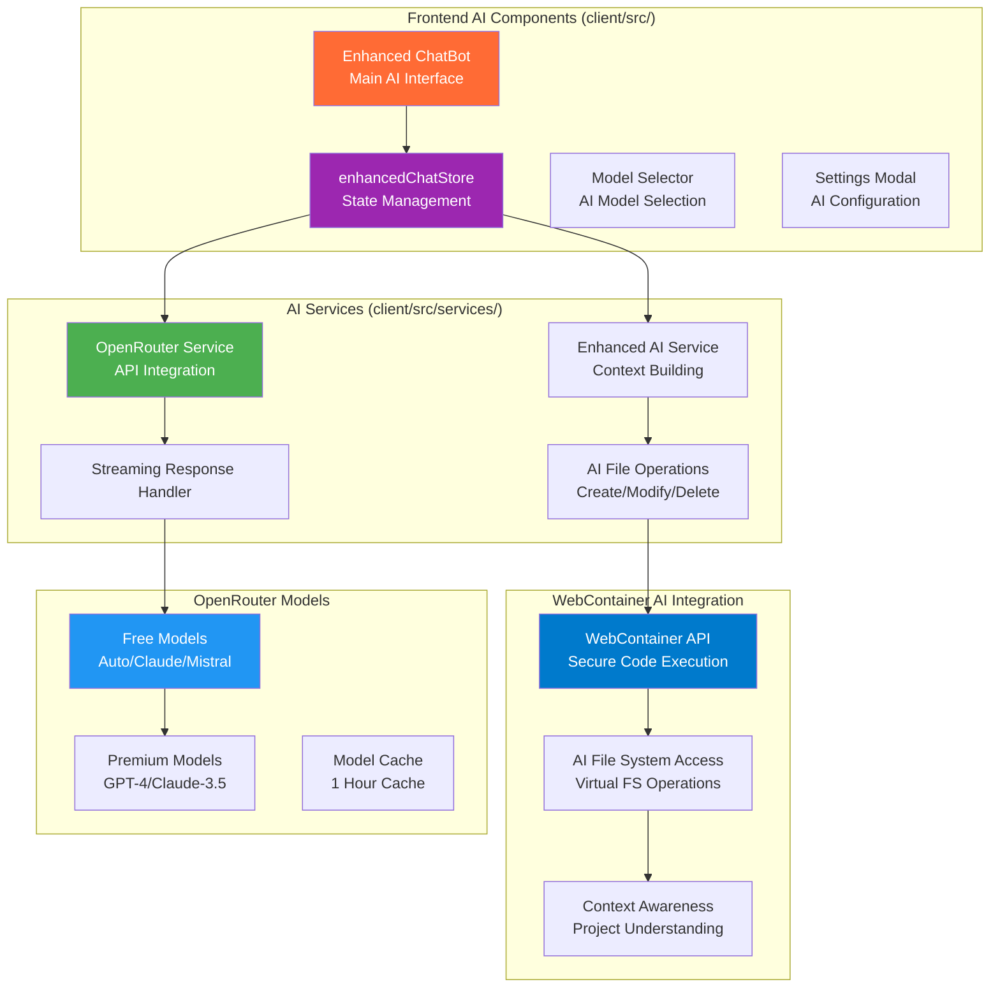
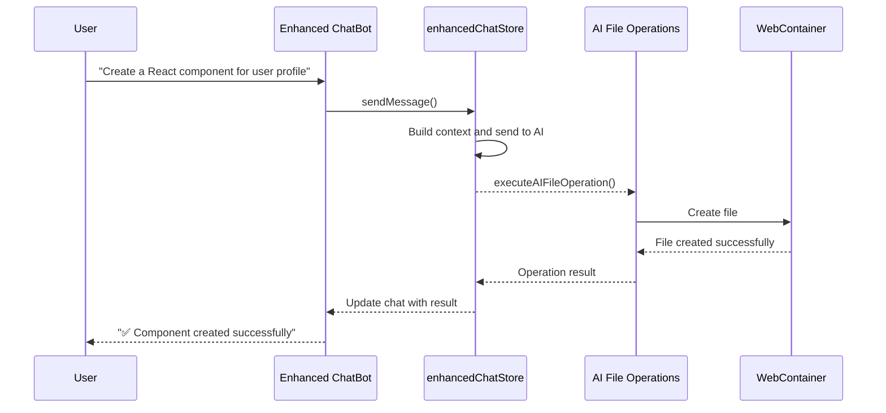
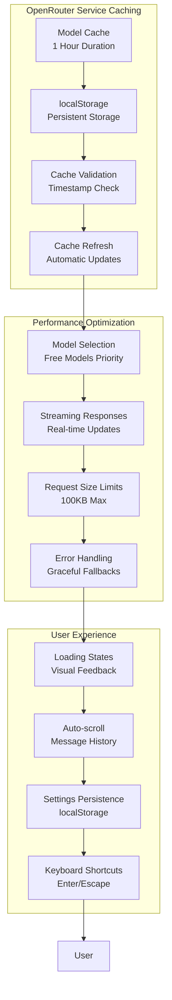
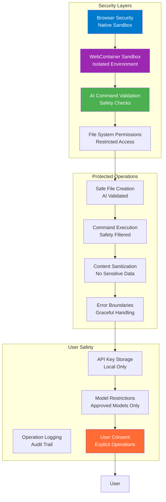

# Chapter 5: AI Integration with OpenRouter

## Overview

AutoCode's AI integration transforms it from a simple code editor into an intelligent development assistant. This chapter explores the actual AI architecture, OpenRouter API integration, and the various AI-powered features based on the real implementation in the AutoCode codebase.

## Actual AI Architecture



## OpenRouter API Integration

### Actual OpenRouter Service Implementation

The real OpenRouter service provides comprehensive API integration with caching, streaming support, and model management:

```typescript
// client/src/services/openRouter.ts - Actual Implementation
export interface OpenRouterModel {
  id: string;
  name: string;
  created: number;
  description: string;
  architecture: {
    input_modalities: string[];
    output_modalities: string[];
    tokenizer: string;
    instruct_type: string;
  };
  top_provider: {
    is_moderated: boolean;
    context_length: number;
    max_completion_tokens: number;
  };
  pricing: {
    prompt: string;
    completion: string;
    image: string;
    request: string;
    web_search: string;
    internal_reasoning: string;
    input_cache_read: string;
    input_cache_write: string;
  };
  canonical_slug: string;
  context_length: number;
  hugging_face_id: string;
  per_request_limits: Record<string, unknown>;
  supported_parameters: string[];
}

export class OpenRouterService {
  private static readonly BASE_URL = 'https://openrouter.ai/api/v1';
  private static readonly STORAGE_KEY = 'openrouter_api_key';
  private static readonly MODELS_CACHE_KEY = 'openrouter_models_cache';
  private static readonly CACHE_DURATION = 1000 * 60 * 60; // 1 hour

  static getApiKey(): string | null {
    return localStorage.getItem(this.STORAGE_KEY);
  }

  static setApiKey(apiKey: string): void {
    localStorage.setItem(this.STORAGE_KEY, apiKey.trim());
  }

  static clearApiKey(): void {
    localStorage.removeItem(this.STORAGE_KEY);
  }

  static isValidApiKey(apiKey: string): boolean {
    return apiKey.trim().length > 0 && apiKey.startsWith('sk-');
  }

  static async getModels(): Promise<OpenRouterModel[]> {
    // Check cache first
    const cached = this.getCachedModels();
    if (cached) {
      return cached;
    }

    try {
      const response = await fetch(`${this.BASE_URL}/models`, {
        method: 'GET',
        headers: {
          'Content-Type': 'application/json',
        },
      });

      if (!response.ok) {
        throw new Error(`Failed to fetch models: ${response.statusText}`);
      }

      const data: OpenRouterModelsResponse = await response.json();

      // Cache the models
      this.cacheModels(data.data);

      return data.data;
    } catch (error) {
      console.error('Error fetching models:', error);
      throw error;
    }
  }

  static getFreeModels(models: OpenRouterModel[]): OpenRouterModel[] {
    // First try to find models with actual free pricing
    const trulyFreeModels = models.filter(model => {
      const pricing = model.pricing;
      return pricing && (
        pricing.prompt === '0' &&
        pricing.completion === '0' &&
        (pricing.request === '0' || pricing.request === null)
      );
    });

    if (trulyFreeModels.length > 0) {
      return trulyFreeModels.slice(0, 10);
    }

    // Fallback to commonly known free models
    const commonFreeModels = [
      'openrouter/auto',
      'mistralai/mistral-7b-instruct',
      'huggingfaceh4/zephyr-7b-beta',
      'openchat/openchat-7b',
      'gryphe/mythomist-7b',
      'undi95/toppy-m-7b'
    ];

    const fallbackModels = models.filter(model =>
      commonFreeModels.some(freeId => model.id.toLowerCase().includes(freeId.toLowerCase()))
    );

    // If still no models found, return first few models (user might have credits)
    if (fallbackModels.length === 0) {
      return models.slice(0, 5);
    }

    return fallbackModels.slice(0, 10);
  }

  static async sendMessage(
    model: string,
    messages: ChatMessage[],
    options: {
      maxTokens?: number;
      temperature?: number;
      stream?: boolean;
      onChunk?: (chunk: string) => void;
    } = {}
  ): Promise<string> {
    const apiKey = this.getApiKey();
    if (!apiKey) {
      throw new Error('API key not found. Please configure your OpenRouter API key.');
    }

    const requestBody: ChatCompletionRequest = {
      model,
      messages: messages.map(msg => ({
        role: msg.role,
        content: msg.content,
      })),
      max_tokens: options.maxTokens || 1000,
      temperature: options.temperature || 0.7,
      stream: options.stream || false,
    };

    try {
      const response = await fetch(`${this.BASE_URL}/chat/completions`, {
        method: 'POST',
        headers: {
          'Content-Type': 'application/json',
          'Authorization': `Bearer ${apiKey}`,
          'HTTP-Referer': window.location.origin,
          'X-Title': 'AutoCode - Online Code Editor',
        },
        body: JSON.stringify(requestBody),
      });

      if (!response.ok) {
        const errorData = await response.json().catch(() => ({}));
        throw new Error(
          errorData.error?.message ||
          `API request failed: ${response.status} ${response.statusText}`
        );
      }

      // Handle streaming response
      if (options.stream && response.body) {
        return this.handleStreamingResponse(response, options.onChunk);
      }

      // Handle regular response
      const data = await response.json();

      if (!data.choices || !data.choices[0] || !data.choices[0].message) {
        throw new Error('Invalid response format from API');
      }

      return data.choices[0].message.content;
    } catch (error) {
      console.error('Error sending message:', error);
      throw error;
    }
  }

  private static async handleStreamingResponse(
    response: Response,
    onChunk?: (chunk: string) => void
  ): Promise<string> {
    const reader = response.body!.getReader();
    const decoder = new TextDecoder();
    let fullContent = '';

    try {
      // eslint-disable-next-line no-constant-condition
      while (true) {
        const { done, value } = await reader.read();

        if (done) break;

        const chunk = decoder.decode(value);
        const lines = chunk.split('\n');

        for (const line of lines) {
          if (line.startsWith('data: ')) {
            const data = line.slice(6);

            if (data === '[DONE]') {
              return fullContent;
            }

            try {
              const parsed = JSON.parse(data);
              const content = parsed.choices?.[0]?.delta?.content;

              if (content) {
                fullContent += content;
                onChunk?.(content);
              }
            } catch (e) {
              // Skip invalid JSON lines
              continue;
            }
          }
        }
      }
    } finally {
      reader.releaseLock();
    }

    return fullContent;
  }

  private static getCachedModels(): OpenRouterModel[] | null {
    try {
      const cached = localStorage.getItem(this.MODELS_CACHE_KEY);
      if (!cached) return null;

      const { data, timestamp } = JSON.parse(cached);
      const now = Date.now();

      if (now - timestamp > this.CACHE_DURATION) {
        localStorage.removeItem(this.MODELS_CACHE_KEY);
        return null;
      }

      return data;
    } catch (error) {
      console.error('Error reading cached models:', error);
      localStorage.removeItem(this.MODELS_CACHE_KEY);
      return null;
    }
  }

  private static cacheModels(models: OpenRouterModel[]): void {
    try {
      const cacheData = {
        data: models,
        timestamp: Date.now(),
      };
      localStorage.setItem(this.MODELS_CACHE_KEY, JSON.stringify(cacheData));
    } catch (error) {
      console.error('Error caching models:', error);
    }
  }
}
```

### Enhanced Chat Store Implementation

The actual chat store manages AI state, streaming responses, and file operations:

```typescript
// client/src/store/enhancedChatStore.ts - Actual Implementation
interface ChatState {
  // Chat State
  messages: ChatMessage[];
  isLoading: boolean;
  model: string;
  apiKey: string | null;
  availableModels: OpenRouterModel[];

  // File Operations
  webContainerInstance: WebContainer | null;
  aiFileOperations: AIFileOperations | null;

  // Settings
  settings: {
    apiKey: string;
    model: string;
    temperature: number;
    maxTokens: number;
    streaming: boolean;
  };

  // Actions
  sendMessage: (content: string) => Promise<void>;
  setModel: (model: string) => void;
  setApiKey: (apiKey: string) => void;
  clearMessages: () => void;
  loadModels: () => Promise<void>;
  initializeWebContainer: () => Promise<void>;
  executeAIFileOperation: (operation: FileOperation) => Promise<void>;
  updateSettings: (settings: Partial<ChatState['settings']>) => void;
}

export const useChatStore = create<ChatState>((set, get) => ({
  // Initial State
  messages: [],
  isLoading: false,
  model: 'openrouter/auto',
  apiKey: OpenRouterService.getApiKey(),
  availableModels: [],

  webContainerInstance: null,
  aiFileOperations: null,

  settings: {
    apiKey: OpenRouterService.getApiKey() || '',
    model: 'openrouter/auto',
    temperature: 0.7,
    maxTokens: 1000,
    streaming: true,
  },

  // Load Available Models
  loadModels: async () => {
    try {
      const models = await OpenRouterService.getModels();
      const freeModels = OpenRouterService.getFreeModels(models);
      set({ availableModels: freeModels });
    } catch (error) {
      console.error('Failed to load models:', error);
    }
  },

  // Send Message with Streaming Support
  sendMessage: async (content: string) => {
    const { apiKey, model, settings } = get();
    if (!apiKey) {
      throw new Error('Please configure your OpenRouter API key first.');
    }

    set({ isLoading: true });

    // Add user message
    const userMessage: ChatMessage = {
      id: Date.now().toString(),
      role: 'user',
      content,
      timestamp: new Date(),
    };

    set(state => ({
      messages: [...state.messages, userMessage]
    }));

    try {
      // Create assistant message placeholder for streaming
      const assistantMessage: ChatMessage = {
        id: (Date.now() + 1).toString(),
        role: 'assistant',
        content: '',
        timestamp: new Date(),
      };

      set(state => ({
        messages: [...state.messages, assistantMessage]
      }));

      // Build message history
      const messageHistory = [
        ...get().messages.slice(-10), // Keep last 10 messages for context
        {
          role: 'system',
          content: `You are AutoCode AI assistant, integrated into a browser-based code editor.
You have access to WebContainer for secure code execution and can help with:
- Code generation and explanation
- File operations (create, modify, delete)
- Debugging and error resolution
- Project structure understanding
- Real-time coding assistance

Be helpful, accurate, and provide code examples when appropriate.`,
        }
      ];

      // Send streaming request
      const response = await OpenRouterService.sendMessage(model, messageHistory, {
        maxTokens: settings.maxTokens,
        temperature: settings.temperature,
        stream: settings.streaming,
        onChunk: (chunk: string) => {
          set(state => ({
            messages: state.messages.map(msg =>
              msg.id === assistantMessage.id
                ? { ...msg, content: msg.content + chunk }
                : msg
            )
          }));
        }
      });

      // Update final message
      set(state => ({
        messages: state.messages.map(msg =>
          msg.id === assistantMessage.id
            ? { ...msg, content: response }
            : msg
        )
      }));

    } catch (error) {
      console.error('Error sending message:', error);

      // Remove the placeholder message and add error message
      set(state => ({
        messages: state.messages.slice(0, -1).concat({
          id: Date.now().toString(),
          role: 'assistant',
          content: `Error: ${error.message}`,
          timestamp: new Date(),
        })
      }));
    } finally {
      set({ isLoading: false });
    }
  },

  // Model Management
  setModel: (model: string) => {
    set({ model });
    localStorage.setItem('autocode_ai_model', model);
  },

  setApiKey: (apiKey: string) => {
    if (OpenRouterService.isValidApiKey(apiKey)) {
      OpenRouterService.setApiKey(apiKey);
      set({ apiKey });
      get().updateSettings({ apiKey });
    }
  },

  clearMessages: () => {
    set({ messages: [] });
  },

  // WebContainer Integration
  initializeWebContainer: async () => {
    try {
      const instance = await WebContainerSingleton.getInstance();
      const aiOperations = new AIFileOperations(instance, enhancedAIService);

      set({
        webContainerInstance: instance,
        aiFileOperations: aiOperations
      });
    } catch (error) {
      console.error('Failed to initialize WebContainer:', error);
    }
  },

  // AI File Operations
  executeAIFileOperation: async (operation: FileOperation) => {
    const { aiFileOperations } = get();
    if (!aiFileOperations) return;

    let result;
    switch (operation.type) {
      case 'create':
        result = await aiFileOperations.createFileFromAI(
          operation.fileName!,
          operation.content!,
          operation.context
        );
        break;
      case 'modify':
        result = await aiFileOperations.modifyFileFromAI(
          operation.fileName!,
          operation.instruction!,
          operation.content!
        );
        break;
      case 'delete':
        result = await aiFileOperations.deleteFileFromAI(
          operation.fileName!,
          operation.instruction!
        );
        break;
      case 'execute':
        result = await aiFileOperations.executeAICommand(
          operation.command!,
          operation.instruction!
        );
        break;
    }

    // Update chat with operation result
    const resultMessage: ChatMessage = {
      id: Date.now().toString(),
      role: 'assistant',
      content: `File operation ${result.success ? 'succeeded' : 'failed'}: ${result.message}`,
      timestamp: new Date(),
    };

    set(state => ({
      messages: [...state.messages, resultMessage]
    }));
  },

  // Settings Management
  updateSettings: (newSettings: Partial<ChatState['settings']>) => {
    const currentSettings = get().settings;
    const updatedSettings = { ...currentSettings, ...newSettings };

    set({ settings: updatedSettings });

    // Save to localStorage
    localStorage.setItem('autocode_ai_settings', JSON.stringify(updatedSettings));

    // Update OpenRouter service
    if (updatedSettings.apiKey) {
      OpenRouterService.setApiKey(updatedSettings.apiKey);
    }
  },
}));
```

### Enhanced ChatBot Component

The actual Enhanced ChatBot component provides the main AI interface with streaming responses and settings:

```typescript
// client/src/components/ChatBot/EnhancedChatBot.tsx - Actual Implementation
export const EnhancedChatBot: React.FC = () => {
  const {
    messages,
    isLoading,
    model,
    apiKey,
    availableModels,
    settings,
    sendMessage,
    clearMessages,
    setModel,
    setApiKey,
    loadModels,
    updateSettings
  } = useChatStore();

  const [input, setInput] = useState('');
  const [showSettings, setShowSettings] = useState(false);
  const [tempApiKey, setTempApiKey] = useState('');

  const messagesEndRef = useRef<HTMLDivElement>(null);
  const textareaRef = useRef<HTMLTextAreaElement>(null);

  // Load models on component mount
  useEffect(() => {
    loadModels();
    setTempApiKey(settings.apiKey);
  }, [loadModels, settings.apiKey]);

  // Auto-scroll to bottom
  useEffect(() => {
    messagesEndRef.current?.scrollIntoView({ behavior: 'smooth' });
  }, [messages]);

  // Handle message sending
  const handleSendMessage = async () => {
    if (!input.trim() || isLoading) return;

    try {
      await sendMessage(input.trim());
      setInput('');
      textareaRef.current?.focus();
    } catch (error) {
      console.error('Failed to send message:', error);
    }
  };

  // Handle keyboard shortcuts
  const handleKeyPress = (e: React.KeyboardEvent) => {
    if (e.key === 'Enter' && !e.shiftKey) {
      e.preventDefault();
      handleSendMessage();
    } else if (e.key === 'Escape') {
      setInput('');
    }
  };

  // Handle API key save
  const handleSaveApiKey = () => {
    if (tempApiKey.trim()) {
      setApiKey(tempApiKey.trim());
      setShowSettings(false);
    }
  };

  return (
    <div className="flex flex-col h-full bg-white border border-gray-200 rounded-lg shadow-sm">
      {/* Header */}
      <div className="flex items-center justify-between p-4 border-b border-gray-200">
        <div className="flex items-center space-x-2">
          <div className="w-3 h-3 bg-blue-500 rounded-full"></div>
          <h3 className="font-semibold text-gray-900">AI Assistant</h3>
        </div>
        <div className="flex items-center space-x-2">
          <button
            onClick={() => setShowSettings(!showSettings)}
            className="p-2 hover:bg-gray-100 rounded-lg transition-colors"
            title="Settings"
          >
            <Settings className="w-4 h-4" />
          </button>
          <button
            onClick={clearMessages}
            className="p-2 hover:bg-gray-100 rounded-lg transition-colors"
            title="Clear messages"
          >
            <Trash2 className="w-4 h-4" />
          </button>
        </div>
      </div>

      {/* Settings Panel */}
      {showSettings && (
        <div className="border-b border-gray-200 p-4 bg-gray-50">
          <div className="space-y-4">
            {/* API Key Input */}
            <div>
              <label className="block text-sm font-medium text-gray-700 mb-1">
                OpenRouter API Key
              </label>
              <div className="flex space-x-2">
                <input
                  type="password"
                  value={tempApiKey}
                  onChange={(e) => setTempApiKey(e.target.value)}
                  placeholder="sk-..."
                  className="flex-1 px-3 py-2 border border-gray-300 rounded-md focus:outline-none focus:ring-2 focus:ring-blue-500"
                />
                <button
                  onClick={handleSaveApiKey}
                  disabled={!tempApiKey.trim()}
                  className="px-4 py-2 bg-blue-500 text-white rounded-md hover:bg-blue-600 disabled:bg-gray-300 disabled:cursor-not-allowed"
                >
                  Save
                </button>
              </div>
            </div>

            {/* Model Selection */}
            <div>
              <label className="block text-sm font-medium text-gray-700 mb-1">
                AI Model
              </label>
              <select
                value={model}
                onChange={(e) => setModel(e.target.value)}
                className="w-full px-3 py-2 border border-gray-300 rounded-md focus:outline-none focus:ring-2 focus:ring-blue-500"
              >
                {availableModels.map((model) => (
                  <option key={model.id} value={model.id}>
                    {model.name}
                  </option>
                ))}
              </select>
            </div>

            {/* Temperature */}
            <div>
              <label className="block text-sm font-medium text-gray-700 mb-1">
                Temperature: {settings.temperature}
              </label>
              <input
                type="range"
                min="0"
                max="2"
                step="0.1"
                value={settings.temperature}
                onChange={(e) => updateSettings({ temperature: parseFloat(e.target.value) })}
                className="w-full"
              />
            </div>

            {/* Max Tokens */}
            <div>
              <label className="block text-sm font-medium text-gray-700 mb-1">
                Max Tokens: {settings.maxTokens}
              </label>
              <input
                type="range"
                min="100"
                max="4000"
                step="100"
                value={settings.maxTokens}
                onChange={(e) => updateSettings({ maxTokens: parseInt(e.target.value) })}
                className="w-full"
              />
            </div>

            {/* Streaming Toggle */}
            <div className="flex items-center">
              <input
                type="checkbox"
                id="streaming"
                checked={settings.streaming}
                onChange={(e) => updateSettings({ streaming: e.target.checked })}
                className="mr-2"
              />
              <label htmlFor="streaming" className="text-sm text-gray-700">
                Enable streaming responses
              </label>
            </div>
          </div>
        </div>
      )}

      {/* Messages */}
      <div className="flex-1 overflow-y-auto p-4 space-y-4">
        {!apiKey && (
          <div className="bg-yellow-50 border border-yellow-200 rounded-lg p-4">
            <div className="flex items-center space-x-2">
              <AlertCircle className="w-5 h-5 text-yellow-600" />
              <div>
                <p className="text-sm font-medium text-yellow-800">
                  API Key Required
                </p>
                <p className="text-sm text-yellow-700">
                  Please configure your OpenRouter API key to use the AI assistant.
                </p>
              </div>
            </div>
          </div>
        )}

        {messages.map((message) => (
          <div
            key={message.id}
            className={`flex ${message.role === 'user' ? 'justify-end' : 'justify-start'}`}
          >
            <div
              className={`max-w-[80%] rounded-lg px-4 py-2 ${
                message.role === 'user'
                  ? 'bg-blue-500 text-white'
                  : 'bg-gray-100 text-gray-900'
              }`}
            >
              <div className="prose prose-sm max-w-none">
                <ReactMarkdown>{message.content}</ReactMarkdown>
              </div>
              <div className="text-xs mt-1 opacity-70">
                {message.timestamp.toLocaleTimeString()}
              </div>
            </div>
          </div>
        ))}

        {isLoading && (
          <div className="flex justify-start">
            <div className="bg-gray-100 text-gray-900 rounded-lg px-4 py-2 max-w-[80%]">
              <div className="flex items-center space-x-2">
                <div className="animate-spin w-4 h-4 border-2 border-blue-500 border-t-transparent rounded-full"></div>
                <span className="text-sm">Thinking...</span>
              </div>
            </div>
          </div>
        )}

        <div ref={messagesEndRef} />
      </div>

      {/* Input */}
      <div className="border-t border-gray-200 p-4">
        <div className="flex space-x-2">
          <textarea
            ref={textareaRef}
            value={input}
            onChange={(e) => setInput(e.target.value)}
            onKeyPress={handleKeyPress}
            placeholder={
              apiKey
                ? "Ask me anything about your code..."
                : "Configure your API key to start chatting..."
            }
            disabled={isLoading || !apiKey}
            rows={3}
            className="flex-1 px-3 py-2 border border-gray-300 rounded-md focus:outline-none focus:ring-2 focus:ring-blue-500 resize-none disabled:bg-gray-100 disabled:cursor-not-allowed"
          />
          <button
            onClick={handleSendMessage}
            disabled={isLoading || !input.trim() || !apiKey}
            className="px-4 py-2 bg-blue-500 text-white rounded-md hover:bg-blue-600 disabled:bg-gray-300 disabled:cursor-not-allowed"
          >
            {isLoading ? (
              <div className="animate-spin w-4 h-4 border-2 border-white border-t-transparent rounded-full"></div>
            ) : (
              <Send className="w-4 h-4" />
            )}
          </button>
        </div>
      </div>
    </div>
  );
};
```

## AI File Operations

The AI integration includes powerful file operations that allow the AI assistant to create, modify, and delete files directly in the WebContainer environment:

### File Operation Types

1. **Create Files**: AI can generate new files based on user descriptions
2. **Modify Files**: AI can edit existing files based on instructions
3. **Delete Files**: AI can safely remove files when appropriate
4. **Execute Commands**: AI can run shell commands in the WebContainer

### AI File Operation Flow



## Performance and Caching

### Model Caching Strategy



## Security and Best Practices

### API Security Implementation

The AI integration includes several security measures:

```typescript
// Security Features in OpenRouter Service
export class SecurityFeatures {
  // 1. API Key Validation
  static isValidApiKey(apiKey: string): boolean {
    return apiKey.trim().length > 0 && apiKey.startsWith('sk-');
  }

  // 2. Request Size Limits
  private static readonly MAX_REQUEST_SIZE = 100000; // 100KB

  // 3. Error Handling
  static handleError(error: any): string {
    console.error('OpenRouter API error:', error);
    return error.message || 'Unknown error occurred';
  }

  // 4. Content Sanitization
  static sanitizeContent(content: string): string {
    // Remove potential sensitive information
    return content
      .replace(/password\s*[:=]\s*\S+/gi, 'password: [REDACTED]')
      .replace(/api[_-]?key\s*[:=]\s*\S+/gi, 'api_key: [REDACTED]')
      .replace(/secret\s*[:=]\s*\S+/gi, 'secret: [REDACTED]')
      .replace(/token\s*[:=]\s*\S+/gi, 'token: [REDACTED]');
  }
}
```

### WebContainer Security Integration

The AI file operations are sandboxed within the WebContainer environment:



## Chapter Summary

In this chapter, we've explored the actual AI integration in AutoCode based on the real implementation:

- ✅ **OpenRouter Service**: Comprehensive API integration with caching, streaming, and model management
- ✅ **Enhanced Chat Store**: Zustand-based state management with AI operations and WebContainer integration
- ✅ **Streaming Responses**: Real-time AI chat with chunked responses
- ✅ **Enhanced ChatBot Component**: Full-featured AI interface with settings and model selection
- ✅ **AI File Operations**: Secure file creation, modification, and deletion within WebContainer
- ✅ **Free Model Support**: Intelligent model selection prioritizing free options
- ✅ **Performance Optimization**: Caching, streaming, and request size limits
- ✅ **Security Measures**: API key validation, content sanitization, and sandboxed execution

### Key AI Features

1. **Real-Time Streaming**: Instant AI responses with live chat updates
2. **Multi-Model Access**: Support for various AI models via OpenRouter
3. **Context-Aware Responses**: AI understands project structure and current files
4. **Secure File Operations**: AI can safely manipulate files within WebContainer
5. **Intelligent Model Selection**: Automatically selects the best available free model
6. **Persistent Settings**: User preferences and API keys saved locally

### Technical Benefits

- **🚀 Performance**: Streaming responses and intelligent caching
- **🔒 Security**: Sandboxed execution and content sanitization
- **🧠 Intelligence**: Context-aware AI with project understanding
- **💾 Persistence**: Settings and API keys stored locally
- **⚡ Real-Time**: Live updates and streaming responses
- **🎯 User Experience**: Intuitive interface with rich settings

> **🔑 Key Takeaway:** AutoCode's AI integration provides a sophisticated, secure, and user-friendly AI assistant that enhances the development experience through intelligent code assistance, real-time collaboration, and seamless file operations within the secure WebContainer environment.

---

**Next Chapter:** [Quality Assurance and Improvements](./06-qa-improvements.md) → Learn about testing strategies, performance optimization, and continuous improvement practices.