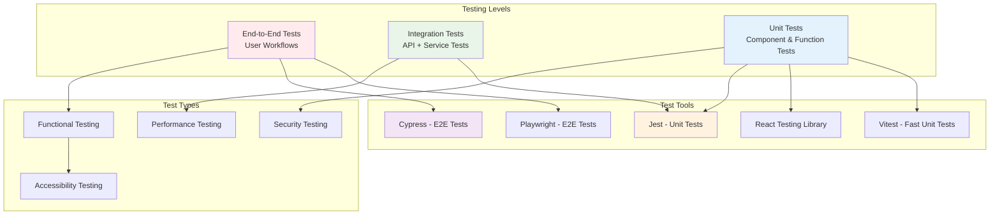
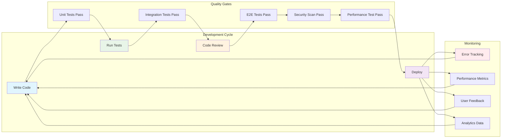

# Chapter 6: Quality Assurance and Improvements

## Overview

Quality assurance is crucial for maintaining a reliable, performant, and user-friendly application. This chapter covers comprehensive testing strategies, performance optimization techniques, security best practices, and continuous improvement processes for AutoCode.

## Testing Strategy

### Testing Pyramid



### Unit Testing

#### Frontend Component Testing

```typescript
// __tests__/components/CodeEditor.test.tsx
import { render, screen, fireEvent, waitFor } from '@testing-library/react';
import userEvent from '@testing-library/user-event';
import { CodeEditor } from '../components/CodeEditor';

// Mock WebContainer
jest.mock('../services/WebContainerService', () => ({
  WebContainerService: jest.fn().mockImplementation(() => ({
    writeFile: jest.fn().mockResolvedValue(undefined),
    readFile: jest.fn().mockResolvedValue('test content'),
  }))
}));

describe('CodeEditor Component', () => {
  const mockProps = {
    fileId: 'test-file-id',
    initialContent: 'console.log("Hello World");',
    language: 'javascript',
    onChange: jest.fn(),
    onSave: jest.fn(),
  };

  beforeEach(() => {
    jest.clearAllMocks();
  });

  it('renders editor with initial content', () => {
    render(<CodeEditor {...mockProps} />);

    expect(screen.getByRole('textbox')).toBeInTheDocument();
    expect(screen.getByDisplayValue('console.log("Hello World");')).toBeInTheDocument();
  });

  it('calls onChange when content is modified', async () => {
    const user = userEvent.setup();
    render(<CodeEditor {...mockProps} />);

    const editor = screen.getByRole('textbox');
    await user.type(editor, ' updated');

    await waitFor(() => {
      expect(mockProps.onChange).toHaveBeenCalledWith(
        'console.log("Hello World"); updated'
      );
    });
  });

  it('calls onSave when Ctrl+S is pressed', async () => {
    const user = userEvent.setup();
    render(<CodeEditor {...mockProps} />);

    const editor = screen.getByRole('textbox');
    await user.click(editor);
    await user.keyboard('{Control>}s{/Control}');

    expect(mockProps.onSave).toHaveBeenCalledWith('console.log("Hello World");');
  });

  it('shows syntax highlighting for JavaScript', () => {
    render(<CodeEditor {...mockProps} language="javascript" />);

    // Test that syntax highlighting is applied
    const editor = screen.getByRole('textbox');
    expect(editor).toHaveClass('monaco-editor');
    expect(editor).toHaveAttribute('data-language', 'javascript');
  });

  it('handles file save errors gracefully', async () => {
    const errorProps = {
      ...mockProps,
      onSave: jest.fn().mockRejectedValue(new Error('Save failed')),
    };

    const user = userEvent.setup();
    render(<CodeEditor {...errorProps} />);

    const saveButton = screen.getByRole('button', { name: /save/i });
    await user.click(saveButton);

    await waitFor(() => {
      expect(screen.getByText(/failed to save/i)).toBeInTheDocument();
    });
  });
});
```

#### Backend Service Testing

```typescript
// __tests__/services/FileService.test.ts
import { FileService } from '../services/FileService';
import { WebContainer } from '@webcontainer/api';

// Mock WebContainer
const mockContainer = {
  fs: {
    writeFile: jest.fn(),
    readFile: jest.fn(),
    exists: jest.fn(),
    readdir: jest.fn(),
    mkdir: jest.fn(),
    rm: jest.fn(),
  }
} as any;

jest.mock('@webcontainer/api', () => ({
  WebContainer: {
    boot: jest.fn().mockResolvedValue(mockContainer),
  }
}));

describe('FileService', () => {
  let fileService: FileService;

  beforeEach(() => {
    fileService = new FileService(mockContainer);
    jest.clearAllMocks();
  });

  describe('writeFile', () => {
    it('writes content to file successfully', async () => {
      const content = 'test content';

      await fileService.writeFile('/test.txt', content);

      expect(mockContainer.fs.writeFile).toHaveBeenCalledWith(
        '/test.txt',
        content
      );
    });

    it('handles write errors gracefully', async () => {
      mockContainer.fs.writeFile.mockRejectedValue(
        new Error('Permission denied')
      );

      await expect(
        fileService.writeFile('/restricted.txt', 'content')
      ).rejects.toThrow('Permission denied');
    });
  });

  describe('readFile', () => {
    it('reads file content successfully', async () => {
      const content = 'file content';
      mockContainer.fs.readFile.mockResolvedValue(content);

      const result = await fileService.readFile('/test.txt');

      expect(result).toBe(content);
      expect(mockContainer.fs.readFile).toHaveBeenCalledWith(
        '/test.txt',
        'utf-8'
      );
    });
  });

  describe('getDirectoryTree', () => {
    it('builds directory tree structure', async () => {
      mockContainer.fs.readdir.mockResolvedValue(['file1.txt', 'subdir']);
      mockContainer.fs.stat
        .mockResolvedValueOnce({ isFile: () => true, size: 100 })
        .mockResolvedValueOnce({ isDirectory: () => true });

      const tree = await fileService.getDirectoryTree('/');

      expect(tree).toMatchObject({
        name: '/',
        path: '/',
        type: 'directory',
        children: expect.arrayContaining([
          expect.objectContaining({
            name: 'file1.txt',
            type: 'file'
          }),
          expect.objectContaining({
            name: 'subdir',
            type: 'directory'
          })
        ])
      });
    });
  });
});
```

### Integration Testing

```typescript
// __tests__/integration/ai-integration.test.ts
import { render, screen, waitFor } from '@testing-library/react';
import userEvent from '@testing-library/user-event';
import { ChatBot } from '../components/ChatBot';
import { AIProvider } from '../context/AIContext';

// Mock OpenRouter service
const mockAIResponse = {
  content: 'Here is your code solution...',
  model: 'anthropic/claude-3.5-sonnet',
  usage: {
    prompt_tokens: 100,
    completion_tokens: 50,
    total_tokens: 150
  },
  finish_reason: 'stop'
};

jest.mock('../services/OpenRouterService', () => ({
  OpenRouterService: jest.fn().mockImplementation(() => ({
    sendMessageStream: jest.fn().mockResolvedValue(mockAIResponse),
  }))
}));

describe('AI Integration Tests', () => {
  it('completes full chat workflow', async () => {
    const user = userEvent.setup();

    render(
      <AIProvider>
        <ChatBot />
      </AIProvider>
    );

    // Send message
    const input = screen.getByPlaceholderText(/ask me anything/i);
    const sendButton = screen.getByRole('button', { name: /send/i });

    await user.type(input, 'How do I create a React component?');
    await user.click(sendButton);

    // Verify user message appears
    expect(screen.getByText('How do I create a React component?')).toBeInTheDocument();

    // Wait for AI response
    await waitFor(() => {
      expect(screen.getByText('Here is your code solution...')).toBeInTheDocument();
    });

    // Verify message metadata
    expect(screen.getByText(/anthropic\/claude-3.5-sonnet/i)).toBeInTheDocument();
  });

  it('handles streaming responses correctly', async () => {
    const user = userEvent.setup();

    // Mock streaming response
    let onChunkCallback: ((chunk: string) => void) | null = null;

    jest.mocked(require('../services/OpenRouterService').OpenRouterService).mockImplementation(() => ({
      sendMessageStream: jest.fn().mockImplementation(async (_, { onChunk }) => {
        onChunkCallback = onChunk!;

        // Simulate streaming chunks
        setTimeout(() => onChunk!('Hello'), 100);
        setTimeout(() => onChunk!(' world'), 200);
        setTimeout(() => onChunk('!'), 300);

        return mockAIResponse;
      })
    }));

    render(
      <AIProvider>
        <ChatBot />
      </AIProvider>
    );

    const input = screen.getByPlaceholderText(/ask me anything/i);
    await user.type(input, 'Say hello');
    await user.click(screen.getByRole('button', { name: /send/i }));

    // Wait for streaming to complete
    await waitFor(() => {
      expect(screen.getByText('Hello world!')).toBeInTheDocument();
    }, { timeout: 1000 });
  });
});
```

### End-to-End Testing

```typescript
// e2e/code-editor.spec.ts
import { test, expect } from '@playwright/test';

test.describe('Code Editor E2E Tests', () => {
  test.beforeEach(async ({ page }) => {
    await page.goto('/');

    // Wait for WebContainer to initialize
    await page.waitForSelector('[data-testid="webcontainer-ready"]');
  });

  test('creates and edits a new file', async ({ page }) => {
    // Create new file
    await page.click('[data-testid="new-file-button"]');
    await page.fill('[data-testid="file-name-input"]', 'test.js');
    await page.click('[data-testid="create-file-button"]');

    // Verify file is created and selected
    await expect(page.locator('[data-testid="file-explorer"]')).toContainText('test.js');
    await expect(page.locator('[data-testid="editor"]')).toBeVisible();

    // Write code in editor
    const editor = page.locator('[data-testid="editor"]');
    await editor.fill('console.log("Hello from Playwright!");');

    // Save file
    await page.keyboard.press('Control+s');

    // Verify save confirmation
    await expect(page.locator('[data-testid="save-indicator"]')).toHaveText('Saved');
  });

  test('runs code in WebContainer', async ({ page }) => {
    // Create and write JavaScript file
    await page.click('[data-testid="new-file-button"]');
    await page.fill('[data-testid="file-name-input"]', 'app.js');
    await page.click('[data-testid="create-file-button"]');

    const editor = page.locator('[data-testid="editor"]');
    await editor.fill('console.log("Test output");');

    // Open terminal
    await page.click('[data-testid="terminal-tab"]');

    // Run the file
    await page.fill('[data-testid="terminal-input"]', 'node app.js');
    await page.press('[data-testid="terminal-input"]', 'Enter');

    // Verify output
    await expect(page.locator('[data-testid="terminal-output"]')).toContainText('Test output');
  });

  test('uses AI assistant for code help', async ({ page }) => {
    // Open AI chat
    await page.click('[data-testid="ai-assistant-button"]');

    // Ask for help
    await page.fill('[data-testid="chat-input"]', 'How do I create a function in JavaScript?');
    await page.click('[data-testid="send-message-button"]');

    // Wait for AI response
    await expect(page.locator('[data-testid="ai-response"]')).toBeVisible();
    await expect(page.locator('[data-testid="ai-response"]')).toContainText('function');
  });

  test('collaborative editing works', async ({ page, context }) => {
    // Open second browser window for collaboration
    const page2 = await context.newPage();
    await page2.goto('/');

    // Create file in first window
    await page.click('[data-testid="new-file-button"]');
    await page.fill('[data-testid="file-name-input"]', 'collaborative.js');
    await page.click('[data-testid="create-file-button"]');

    // Edit file in first window
    const editor1 = page.locator('[data-testid="editor"]');
    await editor1.fill('// Collaborative editing test');

    // Verify changes appear in second window
    await page2.waitForSelector('[data-testid="editor"]');
    const editor2 = page2.locator('[data-testid="editor"]');
    await expect(editor2).toHaveValue('// Collaborative editing test');

    await page2.close();
  });
});
```

## Performance Optimization

### Frontend Performance

```typescript
// utils/performance.ts
export class PerformanceMonitor {
  private static metrics = new Map<string, number>();

  static startTimer(name: string): void {
    this.metrics.set(name, performance.now());
  }

  static endTimer(name: string): number {
    const startTime = this.metrics.get(name);
    if (!startTime) return 0;

    const duration = performance.now() - startTime;
    this.metrics.delete(name);

    // Log performance metrics
    console.log(`[Performance] ${name}: ${duration.toFixed(2)}ms`);

    // Send to analytics in production
    if (process.env.NODE_ENV === 'production') {
      this.sendMetric(name, duration);
    }

    return duration;
  }

  private static sendMetric(name: string, value: number): void {
    // Send to analytics service
    if (navigator.sendBeacon) {
      const data = JSON.stringify({ name, value, timestamp: Date.now() });
      navigator.sendBeacon('/api/metrics', data);
    }
  }

  static measureRenderTime(componentName: string): <T>(result: T) => T {
    return (result) => {
      this.endTimer(`${componentName}-render`);
      return result;
    };
  }
}

// React component with performance monitoring
export const withPerformanceMonitoring = <P extends object>(
  Component: React.ComponentType<P>,
  componentName: string
) => {
  return React.memo((props: P) => {
    PerformanceMonitor.startTimer(`${componentName}-render`);

    const result = <Component {...props} />;

    // Use setTimeout to measure after render
    setTimeout(() => {
      PerformanceMonitor.endTimer(`${componentName}-render`);
    }, 0);

    return result;
  });
};
```

### Code Splitting and Lazy Loading

```typescript
// routes/LazyRoutes.tsx
import { lazy, Suspense } from 'react';
import { LoadingSpinner } from '../components/LoadingSpinner';

// Lazy load components
const EditorPage = lazy(() => import('../pages/EditorPage'));
const SettingsPage = lazy(() => import('../pages/SettingsPage'));
const CollaborativePage = lazy(() => import('../pages/CollaborativePage'));

export const AppRoutes = () => (
  <Router>
    <Routes>
      <Route path="/" element={<HomePage />} />
      <Route
        path="/editor/:id?"
        element={
          <Suspense fallback={<LoadingSpinner />}>
            <EditorPage />
          </Suspense>
        }
      />
      <Route
        path="/settings"
        element={
          <Suspense fallback={<LoadingSpinner />}>
            <SettingsPage />
          </Suspense>
        }
      />
      <Route
        path="/collaborate/:id"
        element={
          <Suspense fallback={<LoadingSpinner />}>
            <CollaborativePage />
          </Suspense>
        }
      />
    </Routes>
  </Router>
);

// Dynamic imports for services
export const loadService = async <T>(serviceName: string): Promise<T> => {
  PerformanceMonitor.startTimer(`load-${serviceName}`);

  try {
    const module = await import(`../services/${serviceName}`);
    PerformanceMonitor.endTimer(`load-${serviceName}`);
    return module.default || module;
  } catch (error) {
    PerformanceMonitor.endTimer(`load-${serviceName}`);
    throw error;
  }
};
```

### Memory Management

```typescript
// utils/memoryManager.ts
export class MemoryManager {
  private static observers: ResizeObserver[] = [];
  private static timers: NodeJS.Timeout[] = [];
  private static eventListeners: Array<{
    target: EventTarget;
    type: string;
    listener: EventListener;
  }> = [];

  static addObserver(observer: ResizeObserver): void {
    this.observers.push(observer);
  }

  static addTimer(timer: NodeJS.Timeout): void {
    this.timers.push(timer);
  }

  static addEventListener(
    target: EventTarget,
    type: string,
    listener: EventListener
  ): void {
    target.addEventListener(type, listener);
    this.eventListeners.push({ target, type, listener });
  }

  static cleanup(): void {
    // Clean up observers
    this.observers.forEach(observer => observer.disconnect());
    this.observers = [];

    // Clean up timers
    this.timers.forEach(timer => clearTimeout(timer));
    this.timers = [];

    // Clean up event listeners
    this.eventListeners.forEach(({ target, type, listener }) => {
      target.removeEventListener(type, listener);
    });
    this.eventListeners = [];
  }

  static getMemoryUsage(): MemoryInfo {
    if ('memory' in performance) {
      return (performance as any).memory as MemoryInfo;
    }
    return {
      usedJSHeapSize: 0,
      totalJSHeapSize: 0,
      jsHeapSizeLimit: 0
    };
  }

  static logMemoryUsage(): void {
    const memory = this.getMemoryUsage();
    console.log('Memory Usage:', {
      used: `${(memory.usedJSHeapSize / 1024 / 1024).toFixed(2)} MB`,
      total: `${(memory.totalJSHeapSize / 1024 / 1024).toFixed(2)} MB`,
      limit: `${(memory.jsHeapSizeLimit / 1024 / 1024).toFixed(2)} MB`,
      percentage: `${((memory.usedJSHeapSize / memory.jsHeapSizeLimit) * 100).toFixed(2)}%`
    });
  }
}

// React hook for memory management
export const useMemoryCleanup = () => {
  useEffect(() => {
    return () => {
      MemoryManager.cleanup();
    };
  }, []);
};
```

## Security Best Practices

### Content Security Policy

```typescript
// utils/security.ts
export const SecurityConfig = {
  // Content Security Policy
  csp: {
    'default-src': ["'self'"],
    'script-src': ["'self'", "'unsafe-inline'", "'unsafe-eval'"],
    'style-src': ["'self'", "'unsafe-inline'"],
    'img-src': ["'self'", 'data:', 'https:'],
    'font-src': ["'self'", 'data:'],
    'connect-src': ["'self'", 'https://api.openrouter.ai', 'wss:'],
    'frame-src': ["'none'"],
    'object-src': ["'none'"],
    'media-src': ["'self'"],
    'manifest-src': ["'self'"],
  },

  // Security headers
  headers: {
    'X-Content-Type-Options': 'nosniff',
    'X-Frame-Options': 'DENY',
    'X-XSS-Protection': '1; mode=block',
    'Referrer-Policy': 'strict-origin-when-cross-origin',
    'Permissions-Policy': 'geolocation=(), microphone=(), camera=()',
  }
};

export class SecurityManager {
  static sanitizeInput(input: string): string {
    return input
      .replace(/[<>]/g, '') // Remove potential HTML tags
      .replace(/javascript:/gi, '') // Remove javascript: protocol
      .replace(/on\w+\s*=/gi, '') // Remove event handlers
      .trim();
  }

  static validateFileName(fileName: string): boolean {
    // Disallow dangerous characters and patterns
    const dangerousPatterns = [
      /\.\./,  // Directory traversal
      /[<>:"|?*]/,  // Invalid characters
      /^(CON|PRN|AUX|NUL|COM[1-9]|LPT[1-9])$/i,  // Windows reserved names
      /^[\.]/,  // Hidden files starting with dot
    ];

    return !dangerousPatterns.some(pattern => pattern.test(fileName));
  }

  static validatePath(path: string): boolean {
    // Ensure path doesn't go outside the workspace
    const normalizedPath = path.replace(/\\/g, '/');
    return !normalizedPath.includes('..') && !normalizedPath.startsWith('/');
  }

  static generateCSPToken(): string {
    // Generate random CSP nonce for inline scripts
    const array = new Uint8Array(16);
    crypto.getRandomValues(array);
    return btoa(String.fromCharCode(...array));
  }
}
```

### API Security

```typescript
// middleware/security.ts
export const securityMiddleware = (req: Request, res: Response, next: NextFunction) => {
  // Rate limiting
  const clientIP = req.ip || req.connection.remoteAddress;
  if (isRateLimited(clientIP)) {
    return res.status(429).json({ error: 'Too many requests' });
  }

  // Content validation
  if (req.body) {
    req.body = sanitizeRequestBody(req.body);
  }

  // File upload validation
  if (req.file) {
    if (!SecurityManager.validateFileName(req.file.originalname)) {
      return res.status(400).json({ error: 'Invalid file name' });
    }

    if (req.file.size > 10 * 1024 * 1024) { // 10MB limit
      return res.status(400).json({ error: 'File too large' });
    }
  }

  next();
};

const sanitizeRequestBody = (body: any): any => {
  if (typeof body === 'string') {
    return SecurityManager.sanitizeInput(body);
  }

  if (Array.isArray(body)) {
    return body.map(sanitizeRequestBody);
  }

  if (body && typeof body === 'object') {
    const sanitized: any = {};
    for (const [key, value] of Object.entries(body)) {
      const sanitizedKey = SecurityManager.sanitizeInput(key);
      sanitized[sanitizedKey] = sanitizeRequestBody(value);
    }
    return sanitized;
  }

  return body;
};

const isRateLimited = (ip: string): boolean => {
  // Implement rate limiting logic
  return false; // Placeholder
};
```

## Monitoring and Analytics

### Error Tracking

```typescript
// services/errorTracking.ts
export class ErrorTracker {
  private static errors: Array<{
    error: Error;
    context: any;
    timestamp: Date;
  }> = [];

  static track(error: Error, context?: any): void {
    const errorInfo = {
      error,
      context: {
        ...context,
        userAgent: navigator.userAgent,
        url: window.location.href,
        timestamp: new Date().toISOString(),
      },
      timestamp: new Date()
    };

    this.errors.push(errorInfo);

    // Log to console in development
    if (process.env.NODE_ENV === 'development') {
      console.error('Tracked Error:', errorInfo);
    }

    // Send to error tracking service in production
    if (process.env.NODE_ENV === 'production') {
      this.sendError(errorInfo);
    }
  }

  private static sendError(errorInfo: any): void {
    // Send to error tracking service (e.g., Sentry, LogRocket)
    fetch('/api/errors', {
      method: 'POST',
      headers: { 'Content-Type': 'application/json' },
      body: JSON.stringify(errorInfo)
    }).catch(err => {
      console.error('Failed to send error:', err);
    });
  }

  static getErrorStats(): {
    total: number;
    recent: number;
    byType: Record<string, number>;
  } {
    const now = new Date();
    const oneHourAgo = new Date(now.getTime() - 60 * 60 * 1000);

    const recentErrors = this.errors.filter(e => e.timestamp > oneHourAgo);
    const errorsByType = this.errors.reduce((acc, e) => {
      const type = e.error.constructor.name;
      acc[type] = (acc[type] || 0) + 1;
      return acc;
    }, {} as Record<string, number>);

    return {
      total: this.errors.length,
      recent: recentErrors.length,
      byType: errorsByType
    };
  }
}

// Global error handler
window.addEventListener('error', (event) => {
  ErrorTracker.track(event.error, {
    filename: event.filename,
    lineno: event.lineno,
    colno: event.colno,
    message: event.message
  });
});

window.addEventListener('unhandledrejection', (event) => {
  ErrorTracker.track(new Error(event.reason), {
    type: 'unhandledrejection',
    promise: event.promise
  });
});
```

### Performance Analytics

```typescript
// services/analytics.ts
export class AnalyticsService {
  private static isInitialized = false;

  static initialize(): void {
    if (this.isInitialized || typeof window === 'undefined') return;

    // Initialize analytics service
    this.trackPageView();
    this.trackPerformance();
    this.trackUserInteractions();

    this.isInitialized = true;
  }

  static trackPageView(path?: string): void {
    const page = path || window.location.pathname;

    this.sendEvent('page_view', {
      page,
      title: document.title,
      referrer: document.referrer,
      timestamp: Date.now()
    });
  }

  static trackEvent(eventName: string, properties?: Record<string, any>): void {
    this.sendEvent(eventName, {
      ...properties,
      timestamp: Date.now(),
      sessionId: this.getSessionId()
    });
  }

  static trackPerformance(): void {
    // Track page load performance
    if ('performance' in window) {
      const navigation = performance.getEntriesByType('navigation')[0] as PerformanceNavigationTiming;

      this.sendEvent('page_performance', {
        loadTime: navigation.loadEventEnd - navigation.loadEventStart,
        domContentLoaded: navigation.domContentLoadedEventEnd - navigation.domContentLoadedEventStart,
        firstPaint: this.getMetric('first-paint'),
        firstContentfulPaint: this.getMetric('first-contentful-paint'),
        largestContentfulPaint: this.getMetric('largest-contentful-paint')
      });
    }

    // Track Core Web Vitals
    this.trackCoreWebVitals();
  }

  static trackUserInteractions(): void {
    // Track clicks
    document.addEventListener('click', (event) => {
      const target = event.target as HTMLElement;
      const eventName = target.dataset.analytics || 'click';

      this.trackEvent(eventName, {
        element: target.tagName.toLowerCase(),
        id: target.id,
        className: target.className,
        text: target.textContent?.slice(0, 50)
      });
    });

    // Track form submissions
    document.addEventListener('submit', (event) => {
      const form = event.target as HTMLFormElement;

      this.trackEvent('form_submit', {
        formId: form.id,
        formName: form.name,
        action: form.action
      });
    });
  }

  private static trackCoreWebVitals(): void {
    // Track Largest Contentful Paint (LCP)
    new PerformanceObserver((list) => {
      const entries = list.getEntries();
      const lastEntry = entries[entries.length - 1];

      this.trackEvent('lcp', {
        value: lastEntry.startTime,
        element: (lastEntry as any).element?.tagName || 'unknown'
      });
    }).observe({ entryTypes: ['largest-contentful-paint'] });

    // Track First Input Delay (FID)
    new PerformanceObserver((list) => {
      const entries = list.getEntries();
      entries.forEach((entry) => {
        this.trackEvent('fid', {
          value: (entry as any).processingStart - entry.startTime,
          eventType: (entry as any).name
        });
      });
    }).observe({ entryTypes: ['first-input'] });

    // Track Cumulative Layout Shift (CLS)
    let clsValue = 0;
    new PerformanceObserver((list) => {
      const entries = list.getEntries();
      entries.forEach((entry) => {
        if (!(entry as any).hadRecentInput) {
          clsValue += (entry as any).value;
        }
      });

      this.trackEvent('cls', { value: clsValue });
    }).observe({ entryTypes: ['layout-shift'] });
  }

  private static getMetric(name: string): number | null {
    const entries = performance.getEntriesByName(name);
    return entries.length > 0 ? entries[0].startTime : null;
  }

  private static getSessionId(): string {
    let sessionId = sessionStorage.getItem('analytics_session_id');
    if (!sessionId) {
      sessionId = Math.random().toString(36).substr(2, 9);
      sessionStorage.setItem('analytics_session_id', sessionId);
    }
    return sessionId;
  }

  private static sendEvent(eventName: string, properties: Record<string, any>): void {
    // Send to analytics service
    if (process.env.NODE_ENV === 'production') {
      fetch('/api/analytics', {
        method: 'POST',
        headers: { 'Content-Type': 'application/json' },
        body: JSON.stringify({ eventName, properties })
      }).catch(err => {
        console.error('Analytics error:', err);
      });
    } else {
      console.log('Analytics Event:', eventName, properties);
    }
  }
}
```

## Chapter Summary

In this chapter, we've covered comprehensive quality assurance and improvement strategies for AutoCode:

- ✅ **Testing Strategy**: Unit, integration, and E2E testing
- ✅ **Performance Optimization**: Monitoring, code splitting, and memory management
- ✅ **Security Best Practices**: CSP, input validation, and API security
- ✅ **Error Tracking**: Comprehensive error monitoring and reporting
- ✅ **Analytics**: User behavior and performance tracking
- ✅ **Continuous Improvement**: Monitoring and optimization processes

### Quality Assurance Benefits

1. **Reliability**: Comprehensive testing ensures consistent performance
2. **Performance**: Optimized for speed and resource usage
3. **Security**: Multi-layered security protects users and data
4. **Maintainability**: Clean architecture and thorough testing
5. **User Experience**: Smooth, responsive, and error-free interactions

### Continuous Improvement Process



> **🔑 Key Takeaway:** Quality assurance is not a one-time activity but a continuous process that ensures AutoCode remains reliable, performant, secure, and user-friendly throughout its lifecycle.

---

**🎉 Documentation Complete!** You now have comprehensive documentation covering all aspects of AutoCode development, from setup to deployment and maintenance.

**Quick Links:**
- [← Previous Chapter: AI Integration](./05-ai-integration.md)
- [🏠 Documentation Home](./README.md)