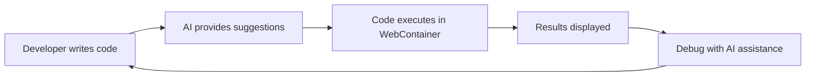
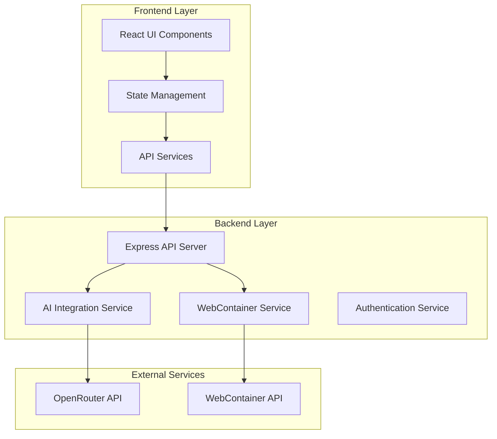

# AutoCode - AI-Powered Online Code Editor

## 🚀 Complete Technical Documentation

Welcome to the comprehensive technical documentation for AutoCode, an innovative AI-powered online code editor that combines modern web technologies with artificial intelligence to revolutionize the coding experience.

## 📋 Table of Contents

### Core Documentation
1. [📖 Introduction and Overview](./01-introduction.md) - Project vision, features, and technology stack
2. [⚙️ Development Setup](./02-development-setup.md) - Complete environment setup and configuration
3. [🏗️ System Architecture and Design](./03-system-architecture.md) - Architectural patterns and system design
4. [🔒 WebContainer Implementation](./04-webcontainer-implementation.md) - Secure code execution in browser
5. [🤖 AI Integration with OpenRouter](./05-ai-integration.md) - AI-powered features and implementation
6. [✅ Quality Assurance and Improvements](./06-qa-improvements.md) - Testing, security, and performance

### Quick Reference
- [📋 Complete Navigation](./_sidebar.md) - Full documentation sidebar with all sections
- [🔍 Search Guide](./search.md) - How to find information quickly

## 🎯 Project Overview

AutoCode is a cutting-edge web application that brings the power of AI directly into your coding workflow. Built with React, Node.js, Express, and WebContainer technology, it provides a secure, isolated environment for code execution with intelligent AI assistance.

### Key Features

- **🤖 AI-Powered Code Assistance**: Get intelligent code suggestions, completions, and refactoring help
- **🔒 Secure Code Execution**: Run code in isolated WebContainer environments
- **💻 Multi-Language Support**: Support for JavaScript, TypeScript, Python, and more
- **🎨 Modern UI/UX**: Clean, responsive interface built with React and Tailwind CSS
- **📱 Real-time Collaboration**: Share and collaborate on code in real-time
- **🔍 Advanced Debugging**: Integrated debugging tools with AI-powered error analysis

## 🏗️ Technology Stack

### Frontend
- **React 18+**: Modern, component-based UI framework
- **TypeScript**: Type-safe JavaScript development
- **Tailwind CSS**: Utility-first CSS framework
- **Zustand**: Lightweight state management
- **Monaco Editor**: Professional code editing experience

### Backend
- **Node.js**: JavaScript runtime environment
- **Express.js**: Fast, minimalist web framework
- **Socket.io**: Real-time bidirectional communication
- **WebContainer API**: Secure code execution environment

### AI Integration
- **OpenRouter API**: Access to multiple AI models
- **Claude 3.5 Sonnet**: Advanced code understanding and generation
- **GPT-4**: General-purpose AI assistance
- **Streaming Responses**: Real-time AI interaction

## 📚 Quick Start

### Prerequisites
- Node.js 18+ and npm
- Git
- Modern web browser with JavaScript enabled

### Installation
```bash
git clone https://github.com/your-org/autocode.git
cd autocode
npm install
npm run dev
```

### Environment Setup
Create a `.env` file with your configuration:
```env
OPENROUTER_API_KEY=your_api_key_here
PORT=3000
NODE_ENV=development
```

## 🎨 Project Structure

```
autocode/
├── client/                 # React frontend application
│   ├── src/
│   │   ├── components/     # Reusable React components
│   │   ├── pages/         # Page components
│   │   ├── hooks/         # Custom React hooks
│   │   ├── store/         # Zustand state management
│   │   ├── services/      # API and external services
│   │   └── utils/         # Utility functions
│   └── public/            # Static assets
├── server/                # Node.js backend application
│   ├── src/
│   │   ├── routes/        # Express route handlers
│   │   ├── services/      # Business logic services
│   │   ├── middleware/    # Express middleware
│   │   ├── utils/         # Utility functions
│   │   └── config/        # Configuration files
│   └── tests/             # Backend test suite
├── shared/                # Shared types and utilities
├── docs/                  # Documentation files
└── markdown-docs/         # This markdown documentation
```

## 🔧 Development Workflow



## 🌟 Key Architectural Patterns

### Microservices Architecture
AutoCode follows a microservices pattern with clear separation of concerns:



## 📖 How to Use This Documentation

Each chapter in this documentation provides:

- **Detailed explanations** of concepts and implementations
- **Code examples** with syntax highlighting
- **Architecture diagrams** using Mermaid
- **Step-by-step tutorials** for common tasks
- **Best practices** and recommendations
- **Troubleshooting guides** for common issues

### Navigation Tips

- Use the sidebar navigation to jump between sections
- Search functionality helps find specific topics quickly
- Code blocks are copyable with one click
- Diagrams are interactive and zoomable

## 🤝 Contributing

We welcome contributions from the community! Please read our [Contributing Guidelines](./CONTRIBUTING.md) for details on:

- Code style and standards
- Pull request process
- Issue reporting
- Documentation improvements

## 📄 License

This project is licensed under the MIT License. See the [LICENSE](./LICENSE) file for details.

## 🆘 Support

- **Documentation**: Check these markdown docs first
- **Issues**: Report bugs on [GitHub Issues](https://github.com/your-org/autocode/issues)
- **Discussions**: Join our [GitHub Discussions](https://github.com/your-org/autocode/discussions)
- **Discord**: Join our community [Discord server](https://discord.gg/autocode)

---

**Happy Coding! 🚀**

*Last updated: November 2025*